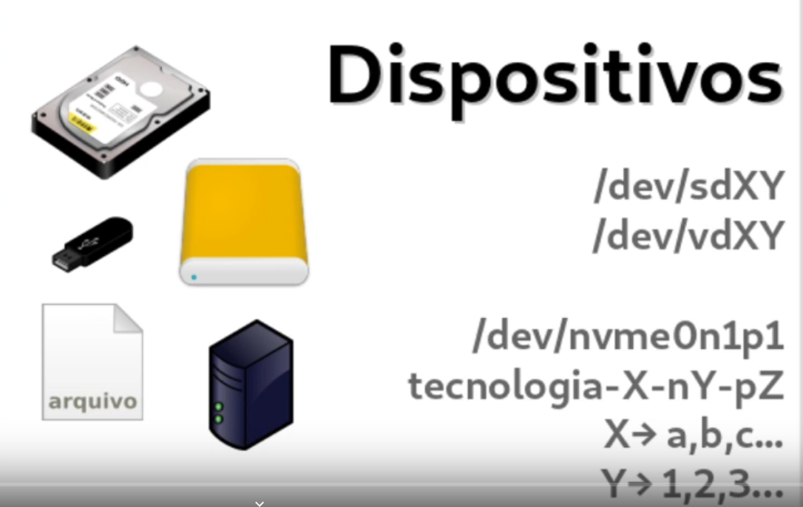

<h3>PROBLEMAS QUE PODEM OCORRER DURANTE INSTALAÇÃO DEBAIN</h3>

**MANUAL DEBIAN**
* www.debian.org/releases/stable/amd64/index.pt.html

* BOOT
>Indicar o dispositivo que ira iniciar o sistema. ou UEFI ou BIOS., a partir do debian BUSTER não precisa desabilitar o "SECURITY BOOT". comanado **DD - Despejo de disco**,as imagens ja credenciam os dois tipos de sistema, UEFI / BIOS., pode ainda calcular o rash da imagem baixada para checar se a imgaem baixada esta ok.

* REDE
>Alguns noteboks precisam de firmware não livres, e como isso pode se deparar com tela reportando com a referẽncia dessa necessidade de firmware não livre, pode baixar de outro computador e apontar a mídia contendo o firmware não livre. Quando tem mais de uma placa o sistema ira detectar e pedir para escolher qual placa deseja usar, rede que não atribui automaticamente ip via DHCP, pode checar primeramente problema físico, cabo por exemplo. Porém saiba o endereço de seguimento do ip pode configurar manualmente, mais ainda pode continuar a instalação, falta da rede não impede a instalação do sistema.

* PARTICIONAMENTO
>Ler atentamente a msg para não apagar disco inteiro, pode separar com atencedẽncia uma partição para instalar ou fazer manualmente os particonamento. Uma observação os sistemas microsoft utilizam um sistema chamaqdo FAST BOOT ,que faz parecer que a iniciação do sistema é mais rápido, porém o que ele faz é uma hibernação., digo isso porque aqui pode ter problema ao participar o disco e durante a instalação do LINux ele reclamar que o modo hibernação do windows, isso em caso de DUAL boot,  esta ligado, e ai precisa desabilitar esse recurso no windows.

* GRUB
>Observer tipo de boot UEFI/GPT.

* INTERRUPÇÃO
>Interrução energia, pode ocorrer. com isso precisara realizar o boot e recomeçar o processo de instalação sem problemas.


<h3>MODELO MENTAL DO BOOT</h3>

* BIOS (BASIC INPUT OUTPUT SYSTEM)
>Sistema que funciona desde a década de 80 e computadores até uns 10 12 anos atrás ainda funcionava com esse mesmo esquema extremamente limitado sem praticamente nenhum recurso muito alimentar e o processo de boot então ele tinha que passar por uma quantidade bastante grande de etapas até que se conseguisse iteração com o sistema operacional.

* UEFI->GPT,DOS,FAT,PE,secure-boot
De uns anos para cá a maior parte das máquinas já possuem o que substitui o bios que é uefi ou efe tem diversas vantagens sobre a bios e eu vou citar algumas delas aqui em qual f conhece ela tem inteligência faz parte do software embutido.
conhecimento o entendimento de como funciona o sistema de particionamento gpt, também conhece o funcionamento do particionamento DOS, conhece o sistema de arquivos fat a bios não conhece qualquer sistema de ar que é ficou esse também o formato de arquivos. Tem recursos programas ali dentro para poder implementar o **secure boot** security é um recurso que faz com que a bios só carregue aquilo que foi assinado por certificados que estão gravados na máquina fazendo com que o sistema não boot qualquer coisa, é um mecanismo bastante interessante muita gente achou que isso era apenas para impedir que os gnu-linux funcionar sem o jogador mais no fim das contas isso acaba servindo de um recurso bastante interessante de configuração e de segurança para corporações, e para uso em desktops.


* Coreboot

* Libreboot

<h3>PARTICIONAMENTO</h3>

* dos/MBR -> 4 partições, 2TB
* GPT - Guid Partition table
* GUID - Globally Unique Identifiers
* 128 partições, 9ZB -> 1ZB 1 bilhão de Tb.

* MBR (512) bytes.
 * stage 1 
  * Primeiros 64 bytes (contém a tablea de partições DOS)
  * Pŕoximos 446 bytes (contém o bootloader) programa que da início ao carregamento do sistema operacional, os bootloaders mais moderno ainda usam um stagio após esse para somente depois começarem as partições.

 * stage 1,5
   

* GPT 
 * Possui Tabela GPT primária e secundária parao caso de algum problema ocorrer.

ESTRUTURA| 
|--------|
Protective MBR |
Primary GPT HEADER |
Entry1 Entry2 Entry 3 Entry4 |
Partition 1 |
Partition 2 |
Remaining Partitions |
Entry1 Entry2 Entry3 Entry4 |
Eentrries 5-18|
Secundary GPT Header |

* BOOTLOADER

GLUB | (Mais de um estágio)
|----|----------------
Estágios|
grub4.efi|
módulos| para poder carregar sistema de aruqivos, módulos de vídeo, criptografia, usar volumes lógicos 
/boot|

>Quando utilizamos a UEFI não precisa de vários estágios porque a UEFI é capaz de entender o sistema de arquivos, portando é capaz de pegar um glub todo, não sendo estágio por estágio e que constuma estar em um arquivo que no caso do **grub** se chama grub64.efi, e esse grub64 também contém os vários módulos necessários, como módulos de rede, sistema de arquivos etc.

* KERNEL
>O Kernel dentro da nossa estrutura de diretório, ele é um arquivo, apenas um arquivo **/vmlinuz/boot/vmlinuz-5.6.13-gnu5-> 15 MB**  esse **z** porquqe esse arquivo  [FHC](https://refspecs.linuxfoundation.org/fhs.shtml)
  * Wwol - Cadas programa de um jeito!
  * Unix like - "Cada coisa no lugar definido"fica compactado dentro da nossa estrutura de diretórios, localizaod dentro do /boot. Esse não tem tamanho fisico depedendo das complicações gerais, a menos que venha pdronizado da equipe do debian. mais nada impede de você compilar seu próprio kernel.

>Módulos | nem tudo que ta no código do kernel esta nesse arquivo do kernel, esta separado, em módulos, o que da um tamanho de 300 MB em média. O que acontece todos os dispositivos que o kernel tem suporte e que na compilação foram determinados para serem compilados, alguns são includos no próprio kernel que chamamos de **módulos BUITIN ou embutidos** e outros tantos foram separados. Então quando vocẽ instala um pacote de kernel, você vai instalar além do arquivo que é o kernel que é esse supramencionado acima, como também um conjunto enorme de módulos queq totalizam ai em torno de 300MB. E justamente por essa formulação modular voce leve o hd que instalou em uma maquina e levar para outra ele vai funcionar embora os hardwares sejam diferentes, lógico que desde que a arquitetura seja a mesma, porque o kernel em tempo de execução, quando ta rodando conversando com os barramentos descobre que hardware e módulo é necessário.


* /INITRD.IMG 
  * /boot/initrd.img-5.6.13-gnu

>É uma imagem de disco, ou melhor é uma imgem de disco, se olharmos dentro ele terá uma porção do  kernel, módulos que não estão no arquivo do kernel mais que são necessários para a sua maquina conseguir ter acesso ao dispositivo principal onde eta o sistema, ou seja seu HD, ele vai incluir esses módulos que são necessário para dar boot ao seu sistema. Quando você instala uma nova versão de kernel, um novo **INITRD.IMG** é montado com as coisas fundamentais que a sua máquina precisa ter acesso a raiz de iretorios e montar o \ , ou seja ter acesso a esturuta de diretório, possui um tamanho 8 a 20 MB porque também tem como a gente interferir como ele é criado. A exemplo posso criar um initrd.img em minha maquina, leva ro hd para outra e não funcionar, dar boot até que refaça o arquivo com os módulos necessários, o nome do arquivo também apresenta o nome da versão ao kernel, cada kernel tem um INITRD.IMG.


>Estrutura do BOOT - inicialização


>BIOS - Identificando os dispositivos


>Menu GLUB 


>Carregando o INITRD E KERNEL - papel do BOOTLOADER.


>SCRIPT INIT DENTRO DO INITRD.IMG - CARREGANDO TODOS OS SERVIÇOS NECESSÁRIO PAR FUNCIONAR.


>LOGIN


>Caso tenha instalado um ambiente gráfico será chamado uma tela que chamamos sde gestor de login gráfico.


>Ambiente DESKTOP, exemplo MATE, DE - Desktop Enviroment.


* PRINCIPIOS DO UNIX
 * HISTÓRICO
 >1956 | KEN THOPSON E DENNIS RITCHIE que começaram nos laboratŕios BELL LABS, MIT, AT&ET, Desenvolvendo um sistema chamado **MULTICS** algo como múltiplus, mais essa junção dessas empresa não deu muuito certo devido terem finalidade divergentes, interesses específicos.

>1969 | Começaram a desenvolver um sitema chamado UNICs -> Unix origem do 'X' do GNULINUX em assembry.

>1973 Começaram a desenvolver um sistema operacional chamado UNIX em uma linguagem chamada 'C'.

>KEN THOMPSON é o criador da linguagem B que mesmo apesar do tempo um dos criadores da linguagem GO.

>IDEIAS | Uma coisa, bem feira, trabrarem juntos, texto interface universal.


>MODELOS | KISS **Keep It Simple Stupid** ou seja mantenha isso simples.

>MODULAR | FLuxo da informação "fluxo -> pipe -> cano, exemplo " **programa1 | programa2** simples combinado  -> complexo.

>ABSTRAÇÃO | Representação arquivo árvore, som, impressora, FHS - Filesystem Hierarchy Standard, que começa no /.

<h3>FHS</h3>
>Filesystem Hierarchy Standart

* Origem 
>Originado Em 1996 quando começaram os trabalhos para definição desse PADRÃO juntamente com a comunidade do BSD - Univserisdade da Califórnia. Hoje é mantido pela LINUX FUNDATION.
 * fonte:
 [FHC](https://refspecs.linuxfoundation.org/fhs.shtml)
  * Wwol - Cadas programa de um jeito!
  * Unix like - "Cada coisa no lugar definido"

  

DIRETÓRIO | Descrição
|--------|-----------
/ | Diretório Raiz
/proc| Processos
/dev |Dispositivos
/boot | Kernel, initrd
/bin | binários (E) Binários essenciais para o sistema
/sbin | binários (adm) Essenciais para adm do sistema 
/lib | bibliotecas - Biblioteca de funçãos que são usadas pelos programas que estão no /bin e /sbin
/etc | Configuração - Aqui todos os programs colocam seus arquivos de configs, para programas maiores com mais arquivos de config. tem um subdiretorio dentro do /etc
/media | Removíveis | monta conteúdo pendrives HDs etc..
/mnt | Temporários - MOntagem termporários de volumos 
/root |Usuário ROOT - Diretório particular do usuário root 
/home | usuários  - Perfil dos usuários 
/var | Variável - Conteúdo variável, ex. servidores web suas páginas ficam em um subdiretório nessa pasta, assim como dentro desse diretíro esta o /var/log que serve para monitorar mensagem de programas.
/tmp | Arquivos temporários - conteúdo desse diretório é apagado quando desliga o sistema 
/usr/bin | Binários de instalação de programas que não são os oficiais encontram -se nesse diretório
/usr/sbin | Binários de administração do sistema 
/usr/lib | Biblioteca que os programas contidos no /usr/bin e usr/sbin estão aqui nesse diretório.
/usr/share | Aquivos independente da arquitetura x86 x64
/usr/share/doc | Documentação dos programas dentro desse diretório, cada programa tem seu subdiretório.
/usr/share/man | Manuais dos programas. 


<COMANDOS BÁSICOS - PROGRAMAS>

1.  cd (Alterar diretório)
2.  ls (Listar conteúdo de diretórios)
3.  mv (mover)
4.  mkdir (criar diretório)
5.  rmdir (remover diretório vazio)
6.  rm -rf (remover diretório não vazio)
7.  cat (imprime saída do conteúdo de arquivo de tela)
8.  less (paginador de tela e permite pesquisar temro usando o `/`)
9.  grep (filtrar termos)
10. find (localizar)
11. tail (ler ultimas linhas texto)
12. head (ler primeiras linhas de texto)
13. --help  (ajuda)
14. man (manual)
15. `|` (PIPE concatenar comandos)
16. `>` (direcionar saida)
17. `>>`  (acrescentar conteúdo ao final de um arquivo de texto)
18. cp (copiar arquivos/diretórios)

* [MATERIAL DE APOIO](https://www.inf.ufpr.br/cursos/ci055/artigos_linux_veteranos/gbbs14.pdf)
* [MATERIAL DE APOIO](https://cotidianoti.com.br/Comandos-basicos-linux/)


* Referẽncias
* Idéia Geral
* Princípais Diretórios
* Passeio

<h3>EDITORES DE TEXTO PURO</h3>


* Plain text
  ```Forma de representação de codificação simplificada inicialmente por caractere - como ASCII (padrão americano para troca de informações) este usa 7 bits de 1 byte que possuem um tamanho de 8 para representar os caracteres - São representados nesse padrão o alfabeto como também alguns caractesrs especiais como ASPAS, CIFRÃO, PORCENTAGEM etc.. os primeiros 32 caracteres de 0 a 31  são caracteres de controle, a exemplo o BEEP, atualmente existe a necessidade muito mais representação de caracteres, porque possuem vários outros idiomas que adotam cacaractres que não estão inclusos dentre esses 128 disponíveis no ASCII. Com isso ele foi evoluindo e hoje existem vários outros padrões, ATUALMENTE o mais utilizado é o UTF-8 (também chamadao de UNICODE) que quer dizer Unicode Transformation Code, este usa também como unidade um BYTE, porém pode usar de 1 até 4 bytes para representar cada 1 dos caracteres e com isso a quantidade de caracteres podendo ser representada pelo UTF-8 passa de um muilhão de caracteres, uma observação é que o ele é também compatível com o padrão ASCII uma vez que este possui a mesma representação no UTF-8, em resumo os caracteres representados pelo ASCII também é representado no UTF-8```.

  * IMPORTÂNCIA
   
    * Linguagem de programação
    * Unix-like
    * Arquivos de configuração 
    * Ambiente gráfico 
    * pluma
    * gedit
    * geany
    * kate
    * kwrite 

  * USO EM TERMINAIS
    * Nano, joe
    * vim vim-basic
    * nvi -> 4.4BSD
    * mcedit -> Midnight Commander.  

* Conteúdo adicional
    * (https://pt.wikipedia.org/wiki/ASCII)
    * (https://pt.wikipedia.org/wiki/UTF-8)
    * (https://pt.wikipedia.org/wiki/Texto_simples)

* Repositório para estudo de funcionalidades
    * (https://github.com/calangohc/apresentacoes/tree/master/vim-magnun)

* Videos (palestra VIM)
    * (https://www.youtube.com/watch?v=UUzW46SeLhg)
    

* SOBREVIVÊNCIA NO "VIM"
 * [Material de apoio](https://github.com/calangohc/apresentacoes/tree/master/vim-magnun) 

 * MODOS
   * COMANDO
   * VISUAL
   * INSERÇÃO
   * LINHA DE COMANDO

<h3>PACOTES</h3> 


* ASCII e derivados
* Unicode -> utf-8 compatível 

<h3>SISTEMAS DE ARQUIVOS</h3>
<h4>Conceitos</h4>

* Código Fonte
* Compilador
* Biblioteca de desenvolvimento
* Conhecimento Técnico Específico

>PACOTE:
* Um pacote de software é a menor unidade que pode ser instalado que usa pacotes, um poacote pode contar um único programa. Algumas vezes funciona por si só, apenas pensas daquele programa. Em outras circunstãncias precisa de bibliotecas de funções que são usadas por vários programas, Logo um pacote pode ser compostos por várias dessas bibliotecas. Há pacores ainda de documentação, como dentre outros como :
  * Fontes
  * Icones 
  * Temas de ambiente
  * Dados
  * Textos

>Um pacote pode ter mais de um programa, e um programa para funcionar pode precisar de vários pacotes. Porém existem pacotes que podem precisar de dependências, o que são essas **DEPENDÊNCIAS** são outros pacotes que aquele pacote que eu quero instalar precisa para que ele funcione, ou seja um apcote precisa de outro pacote, para que seja instalao o pacote A precisa do pacote B que essa por é necessário para o funcionando do pacote B. Pacotes debian vem recomendando existalação de pacotes dependentes. 


>O **PACOTE .DEB** nada mais é do que um arquivo compactadom em um formato chamado AR, esse arquivo compactado tem tudo que é preciso para isntalar aquele específico  pacote, como informações do que ele depende, as info daquele pacote vai fazer, quem fez, endereço do desenvolvedor, a imagem acima mostra a estrutura de uma pacote.

* \user
 * \bin (mostra os binários, ou seja esse pacote instala dois programas)

* \share (informação compartilhada do pacote)
 * \doc (Onde será alocada toda a documentação de todos os pacotes que são instalados)
 
* \man
 * \man1 (Manuais do programa - todo programa precisa ter uma página de manual seguindo assim a estrutura de empacotamento das disribuições)

* Pacotes também trazem scripts que são pequenos progarmas interpletados que poderão serem executados em alguns momentos no processo de instalação., antes da instalação, após remoção.

* A instalação de um pacote DEIAN não somente é a instalação de um pacote  e esse pacote realizar o que quizer em seu ambiente, esse pacote é interpletado, é aberto, é observado pelo gestor de pacotes e todas essas ações são praticadas, e existem registros dessas ações, logo é possivel saber quando um pacote foi instalado, se um pacote esta isntalado, usa-se no debian um sistema que consegue gerir, tomar contas dos pacotes para que possamos ter controle do nosso sistema de maneira completa. Um dos arquivos que vem no pacote é o **MD5SUMS** esse aruivo traz o hash da integridade dos arquivos. Cada arquivo que foi incluido por esse pacote é possível verificar mantém a integridade aos que foram produzidos. Podendo a qualquer tempo checar quanto a integridade dos mesmos.


<h3> BASE APT</h3>

* INSTALAR 
* REMOVER 
  * Remove tudo que o pacote instalou, mais mantém por uma questão de facilidade em alguns pacotes específicos, arquivos de configuração, caso instale um novo pacote ele não substituirá os arquivos ce configuração.

* ATUALIZAR LISTA 

  * Durante a instalação de um pacote , a ferramenta irá verificar existẽncia de dependência e caso precise irá instalar. Importante de tempos em tempos atualizar a base de pacotes disponíveis.

* ATUALIZAR SISTEMA 
  * compara a versão dos pacotes instalada com as versões diponíveis na lista para instalação, cabe isso ao gestor de pacotes realizar esse processo.

* PURGAR 
  * Remove o pacote instalado bem como suas ramificações, a exemplo: arquivos de configurações.

* ARQUIVO DEB

<h3>REPOSITÓRIOS</h3>

 * Onde estão localizados  o espelhos dos pacotes disponíveis na WEB., que funciona via HTTP, HTTPS, FTP.

 * /etc/apt/sources.list -  (espelhos de repositórios ficam espalhados pelo mundo inteiro)

 >Com essa estruruta de pacotes para quem não esta acostumado precisa verncer um paradígma de donwloade des progranas exe do universo windows, não há uma gestão de pacotes. Nos pacotes Linux tem seus próprios arquivos, não pode um arquivo estar em dois pacotes ao mesmo tempo, a forma de encontrar um programa é diferente, ou seja é priorizado a fonte oficial do sistema operacional.

<h3> GERENCIADORES DE PACOTE </h3>

 * DPKG 
 * APT  - 
 * APT-GET 
 * APTITUDE

 * SYNAPTIC
 * GNOME-SOFTWARE
 * DISCOVER
 * "LOJINHA" 

 <h3> BÁSICO </h3>
  
  COMANDO | Descrição
|--------|-----------
apt update | Consulta a lista de repostiórios que vocẽ configurou, acessa os sites e baixa a lista atualizada de todos os pacotes que estão lá disponíveis, bem como todas as informações de cada um desses pacote. 
apt search pesquisa | Pesquisa pacote com base em um parâmetro que deseja pesquisar, nome do pacote, bem como a funcionalidade do pacote, ex. `apt search pdf` irá pesquisar pacotes que manipulam arquivos PDFs.
apt install nome-pacote | Instalar um pacote
apt-remove | Desinstalar o pacote, se for um arquivo que possui arquivos de configuração separado, esses serão preservados. Para remover o pacote bem como seus arquivos de configurações, usamos o apt-purge e o nome do pacote `apt purge pacote`.
apt-upgrade | Serve para atualizar seu sistema, ele vai comparar na base do apt tudo que vocẽ tem instalado com toda  a lista de pacotes que esta disponíveis nos repostiórios, para saber se na lista de repositórios um pacote que vocẽ tem instalado e que possua uma versão mais recente.
apt full-upgrade | Atualização completa, porém caso tenha um pacote instalado que ja não faça mais parte na nova versão, esse será removido, em algumas circunstâncias será necessário remover alguns pacotes que vocẽ tem instalado.
dpkg -l | Lista todos os pacotes cum sua devida versão que temos instalado em nossa maquina.
dpkg -L | Saber arquivos que um pacote instalou em nossa maquina esse comando te retorna.

>Obs: cuidados ao remover pacote, observe as dependẽncias, na lista de pacotes  pode mostrar uma sigra `RC` que indica que o pacote foi removido porém seus arquivos de configuração permanecem.

<h3>SISTEMAS DE ARQUIVOS</h3>

* ABSTRAÇÕES
* ANALOGIA
* CONCEITOS
* TIPOS
* CARACTERISTICAS.

>Imagine que você tenha um terreno, e precisa alocar um espaço nesse terreno para um estacionamento, de forma rotativo, na análoogia esse terreno se chama partição. Porém esse terreno precisa ser preparado para ser usado como estacionamento, como faixas, Organização de como os carros vão entrar e sair, Cabine, nessa cabine precisara ter uma pessoa para realizar o controle de entradas e saidas, bem como o registro. Toda essa analogia e a de criar um sistema de arquivos, ou seja, o procedimento conhecido como formatar, eu formato uma partição, preparo um terreno para ser um estacionamento.Nessa história toda os carreos serão armazenados usando um método, como será o procedimento de quando chegar o carro, quando alguém for resgatar o carro. Nesse método também ta envolvido na cabine uma planchetinha que armazena informações características daquele carro, não o próprio carro mais as informações relativas ao carro, Placa, Vaga que ele foi colocado, nome do motorista, a hora que se deu o estacionamento. Tudo isso devidamente registrado na planchetinha, na nossa análogia isso é chamado a **ÁREA DE CONTROLE** veja que os carros são alocados de forma que um não atrapalhe o outro, é possível que você remova um carro mesmo que ele tenha chegado antes. Da mesma forma que os veículos são alocados em um armazenamento, os dados são alocado no **SISTEMA DE ARQUIVOS** , agora imagine que você tem o outro terreno com a mesma metragem quadrada e você quer nele também montar um estacioanmento, porém agora é um outro tipo de estacionamento, nesse este será perto de um porto de passageiros, esse tipo agora de estacionamento a forma de fazer as coisas é diferente porque os passageios vão chegando com seus carros e vão estacionando, mais eles não precisam tira os veículos do local por um tempo de 15, 20 ou 1 HR., vão todo mundo para o navio, realizam seu cruzeiro e na volta que removerão seus veículos. Observe que nesse estacionamento como no outro também foram pintadas faixas, cabine e se pensou na organização, como como esses veículos serã retiradas. Também nessa cabine desse estacionamento teremos uma planchetinha que descreve o metodo como esses carros vão ser armazendos contendo algumas informações específicas desse jeito guardar o carro. Além dessa plancheta também precisamos de uma pessoa que dentro da nossa analogia é um módulo do **KERNEL** o Kernel precisa conhecer, e ele conhece isso através de um módulo como é que as infomrações são armazenadas. O estacionamento funcionou, os carreos foram guardados e podem também serem recuperados, mais veja na ultima imagem tem um carro atrás de outro., notem que ambos os estacionamento são iguais, note que os estacionamento possuem o mesmo tamanho, a mesma dimensão. Mais em virutde da finalidade que cada estacionamento possui, a maneira de armazenar os carros é diferente o que provoca várias coisas, por exemplo, um estacionaemnto o processo de tirar um carro e colocar um carro é muito fácil, ja no segundo é muito mais dificil isso, caso precise tirar um carro que esteja em local onde outros carros estão obstruindo, será necessário remover outros carros para somente poder remover o carro específico que deseja. De maneira que é possível determinar que cada sistema pos,ui suas características adequada de alocação, pode ser adequada a uma finalidade mais não a outra, cada sistema de arquivo é melhor em uma ou outra condição, não existe um sistema de arquivo melhor em todos os sentidos. um conceito importante e que temos uma estrutura ai que são camadas de abstração. Os programas desconhecem essa história, isso é apenas na abstração que o KERNEL engrega para eles. E nós u suários entendemos que os arquivos estão em diretórios, mais nós ja sabemos que os arquivos são armazenados em uma partição usando um sitema de arquivos e o kernel tem acesso a isso porque ele possui um módulo que conhece o método, a forma com que as informações são armazenadas naquele disco, mais para o kernel te entragar essa abstração ele precisa de módulos de onde  o disco esta conectado, em que barramento, um módulo especifico, cada disco pode ter um módulo ou driver diferente para funcionar. É importante saber que um disco não tem diretório, não tem arquivo. O disco tem blocos de 1 e 0, então o disco não entende essa estrutura, a estrutura é uma abstração que esses módulos e o kernel promovem para ficar fácil para os aplicativos e para nós. 
Existse um conceito chamado **INODE** que é um espaço na planchetinha localizada na área de dados que contém infomrações chamadas  **METADADOS** sobre um arquivo ou sobre um diretório. Os **METADADOS** são informações relativas ao arquivo mais não o dado em si, são informações como:
* tempo
* permissões
* tipo 
* tamanho
* endereço  500 - (endereço de um bloco da área onde esses dados do arquivo efetivamente estão) nesse caso o endreço do bloco que contém os dados desse arquivo é o 500.

> Cada **INODE** possui um número único no sistema da arquivos.

>Quando **APAGAMOS** uma informação no disco, e limpado apenas a  informação de dados do bloco  que contém os dados do diretório/arquivo, ou seja do ponto de vista de nossa abstração esse dado foi removido, porém os dados em si permanecem, os dados não são nem tocados, os blocos do disco que são utilizados para armazenar esses dados não são nem mexidos, por isso é possível recuperar com aplicativos específicos e não mais acessando a pasta ou local onde estavão. Apenas não sera mostrados/visualizados mais com comandos de listagem, nem abrindo o local onde antes mostra as informações do arquivo. Com isso o **INODE** é liberado e novamente pode receber outras informações. 

>Quando **FORMATAMOS UMA PARTIÇÃO** com os dados não acontecem nada, apenas é limpa a ára de controle, portando as informações dos **INODES** serão todas sobrescritas, mais os dodos mesmo dos arquivos vão continuar lá. Poratndo quando formatamos um disco para passar para frente ou descartar, outra pessoa pode usar uma ferramenta de rcuperação para recuperar esses dados, uma ferramenta linux muito boa para esse tipo de operação é o **FOREMOST**.

>Quando **MOVEMOS** um arquivo na realidade estamos apagando a infomação do arquivo que ele faz parte e copiando essas informaçõe para dos dados de outro diretório que agora ele fará parte. o **INODE** do arquivo não vai ser troacado, de modo que não havera necessidade de transferir uma grande quantidade de dados.


<h3>SISTEMA DE ARQUIVOS</h3>


<h3>JOURNALING</h3>
<h4>Ordem de escrever - escrita efetiva</h4>


>Toda vez que o kernel recebe uma ordem para escrever dados no dispositivo de armazenamento, ele anota nessa área chamaa Jornaling que recebeu essa ordem. Quando efetivamente o kernel trocando informações com o disco grava essa informação no disco ele volta la no Jornaling e reaiza um ticket , ou seja uma marcação informando que o arquivo foi gravado. Os sistemas de arquivos que usam esse recurso de Jornaling, eles são mais facilmente recuperados a sua integridade quando por exemplo uma interrupção de energia elétrica, porque quando o sistema volta no Jornaling e verifica algumas operações que não foram tikadas, logo ele sabe os INODES que ficaram sem ou com altearções. em um sitesmta de arquivo que **NÃO TEM JORNALING** no caso o EXT2, esse processo é muito mais demorado porque o programa tem que scanear todos os inodes disponíveis para ver quais estão e quais não estão sendo utilizados, para que a gente tenha certeza que tudo aquilo que a gente ordenou foi efetivamente escrito, a gente costuma usando um programa usado chamado **SYNC** o SYNC diz ao kernel para o kernel acelerar o processo, e ele vai dar essa ordem para escrever efetivamenete tudo que tem que estar  escrito e só é liberado quando tudo estiver devimdamente inscrito. podemos comparar esse procedimento quando recebemos a msg **VOCÊ JA PODE REMOVER SEU PENDRIVE COM SEGURANÇA** todas as ordens para escrever uma informação ou para apagar ja foram realizadas, ou seja o sistema de arquivos está todo integro.

<h4>FRAGMENTAÇÃO (SKLACKSPACE)</h4>


1 - Ocupa dois blocos e o pedacinho de um terceiro, o resto não pode ser usado, não tem como ser indexado. (essa parte que não pode ser usado é chamada dE **slackspace**) assim segue os mesmos arquivos em cores divergentes.
2 - Algum programa mandou apgar-se o arquivo amarelo, ou seja esses blocos estão disponíveis para uso, porém os dados que estavam ali vão continuar da mesma forma sem mexer. 
3 - Algum momento um outro pograma manou gravar o arquivo azul, esse precisava de 3 blocos e mais ou um outro tanto de espaço, ele irá grava no espaço que antes estava utilizado o bloco amarelo que foi apagado,o restante do arquivo azul terá que ser gravado em blocos disponiveis mais a frente.  Ou seja não foi gravdo de forma contígua, ficando assim o arquivo azul fragmentado, espalhados pelo disco.

>Sistemas como FAT e NTFS são mais sucetiveis a fragmentações, ja em sistemas Linux em sisteams EXT4 é bastante insignificante o nível de fragmentação, embora também exista aplicativo para realizar tal procedimento em linux.

<h4>TIPOS DE SISTEMA DE ARQUIVOS</h4>

SITEMA DE ARQUIVOS | Descrição
|--------|-----------
ext2 | usado muito tempo, não possui Jornaling 
ext e ext4 | Sistemas mais atuais e que possuem sistema de Jornaling
squartfs, ISO-9660 | São sistemas de arquivos para apenas leitura, ou seja quando cria os dados ja estão todos alí, não tem como editar arquivos, remover ou inserir sobrescrevendo assim os que ali ja existem, são sistemas de arquivos para apenas READ ONLY(somente leitura)
xfs,jfs,zfs,btrfs | Tipos mais usados em unixlike, GNULinux
FAT-32,NTFS, ExtFat(pendrivers atuais)  | Sistema de arquivos 
windows.
hfs | Sistemas MAC-OS.

* Visualizando sistema de arquivos.
 * `cat/proc/fileystems`

 * MATERIAL DE APOIO 

  * [Inode](https://pt.wikipedia.org/wiki/N%C3%B3-i)
  * [Jornaling](https://pt.wikipedia.org/wiki/Journaling)
  * [Comparação de sistemas de arquivos](https://en.wikipedia.org/wiki/Comparison_of_file_systems)
  * [Ext4](https://pt.wikipedia.org/wiki/Ext4)
  * [ReiserFS](https://pt.wikipedia.org/wiki/ReiserFS)
  * [Btrfs](https://pt.wikipedia.org/wiki/Btrfs)
  * [NTFS](https://pt.wikipedia.org/wiki/NTFS)

<h4>TRABALHANDO COM SISTEMA DE ARQUIVOS</h4>

 * Dipositivos 
  * A representação dos dispositivos pousseum diretório específico para eles que é o `/dev` então os discos ou dispoistivos de armazenamento recebe o nome de um arquivo que vai permitir o acesso direto a esse dispositivo como na imagem abaixo:

  

  >Em maquinas virtuais os dispostivivos recebem o nome de `VD``VDA - Primeiro disco virtual` `VDB-segundo disco virtual`, sequencilalmente nomeando suas partições como `VDA1-primeira partição do primeiro disco` `VDAB-Segunda partipção do primeiro disco` seguindo logiamente para partições quantas tiverem, assim como de mesma forma os discos `VDB1 - Primeira partição do disco B` `VDB2 - segunda partição do disco B.`

  >Em tercnologias mais modernas que usam o discos NVME o arranjo ficará da seguinte forma: `/dev/nvme0n1p1 - Primeira parte  nvme0n1 - Disco, p1 - Partição`

 * Particionamento 
  
  

  >São partes de um disco, no GNU podemos usar mais de um formato de particionamento, o mais habitual é o particionamento GPT e o particonamento DOS/MBR. Nos sistemas GPT podemos alocar até 128 partições, ja em partições DOS/MBR como mostra a figura só poderemos usar 4 partições primárias, ou criar uma partição extenida para inserção de mais partições lógicas.

 * Criar FS
  * "FORMATAR" Preparar área de controle.

  `mkfs.ext4, mkfs.vfat,mkfs.reiserfs`

  * "VERIFICAR"  integridades dos arquivos
   * `fsck`
   * `win hybernation`
   * "**embromation** - quando desligamos maquinas com sistemas windows, na realidade ele não desliga totalmente o equipamento, deixa a maquina em um estado intermediário(Hibernado) e caso vocẽ tente escrever nessa partição a partir de um sistema linux estando em dual boot você vai receber uma msg informando que a unidade esta hibernada. "

 * MONTAR MÍDIAS 

 
 
 * Espaço
>Espaço usado em tese seria a soma to total de arquivos gravados no disco, porém lembre-se que nem sempre um arquivo ocupa totalmente um bloco, o que irá gerar uma sobra, sendo aqui um pouco menor do espaço ocupado, é o espaço que não pode ser usado. **AINDA ASSIM** existe um espaço reservado para o usuário **ROOT**.

 

 <h4>MÃO DA MASSA - CRIANO E APAGANDO PARTIÇÕES</h4>

  * **FDISK**

  >OBS o "*" apontado na partição do disco informa ao BOOT LOADER que ali possui um boot, ou seja ela é inicializável.

>NOTA - Para listar as partitions que o kernel entendeu pode usar o comando `cat /proc/partitions`.

 COMANDO | Descrição
|--------|-----------
`fdisk /dev/sda` | diz ao FDISK para trabalhar com o dispositivo diretamente
`m` | Mostra menu de ajuda 
`d` | Exclui uma partição, será mostrada numero de partições pedindo para selecionar a partição desejada para apagar, por padrão se apenas pressionar ENTER aparára a última.
`w` | Grava as alterações, lembre-se caso saia do sistema sem antes confirmar as alterações com pressionando `w` nada será aplicado.
`g` | Cria uma nova tabela de partições  GPT
`n` | Cria uma nova partição
`t` | Escolhe tipo de sistema de arquivo a ser utilizada 
`ls /dev/sda*` | Para visualizar a lista de partições disponíveis 

>Na dúvida digite `q` para sair da tela.

>NOTA - Note que com a listagem longa observer que na primeira coluna começa com "b" o quer dizer que trata-se de um dispositivo de blooco, ou seja que o dispositivo envia informações em bloco, trata-se de um arquivo que representa um dispositivo.

 * **FORMATAR** - CRIAR O SITEMA DE ARQUIVOS
 
 COMANDO | Descrição
|--------|-----------
`mkfs.ext4` | Realiza a formatação da partição.

>NOTA - caso queira saber em algum momento o que é acessado quando digitamos um comando, para usar o comando `which mkfs.txt4`, mostra onde esta o binário.

>NOTA - Durante a formatação é preparada a área de controle sobre os blocos que estão sendo usados , os que não esta sendo usados, e o backup desses blocos, quando a gente formata também e criado para aquela partição um **ID** para que quando em um futuro assim desejar, quisera montar automaticamente essa unidade, isso poderár ser feito.

 * Formatado no nosso caso o **SDA2** vamos formatar a primeira partição com o comando:
  * `mkfs.vfat /dev/sda1`  - Após isso é preciso montar para somente assim puder escrver informações nessa unidade/partição criada/formatada, para isso usamos o comando abaixo:
  * `mount /dev/sda2 /mnt` - Aqui passamos o comando **mount** o **caminho do dispositivo** e **ponto de montagem**, ou seja o diretório que essa partição será montada.
 * Demontando partição montada
  * `sudo umount /mnt`

>NOTA - para visualizar lista de dispositivos de armazamento, bem como seus espaços utilizados e disponíveis use os comandos `df -h` ou `df -H`.

* VERIFICAR A **INTEGRIDADE** DO DISCO

>NOTA: Integridade é verificar se toda a estrutura da área de controle esta ok, se foi montada adequadamente ou desmontada, toda vez que montamos uma partição é escrito lá que ela foi montada 
e quando desmontamos essa alteração e realizada para o status de desmontada.

 * `fsck.ext4 /dev/sda`

* OBTER INFORMAÇÕES SOBRE O SISTEMA DE ARQUIVOS
   
 * `dumpe2fs /dev/sda2` - Traz informações soebre o sistema de arquivos, são várias, uma bacana de ver é a última vez que foi checado, numero de INODES, DATA DE CRIAÇÃO DO SISTEMA DE ARQUIVOS, ULTIMA VEZ QUE ELE FOI MONTADO, ULTIMA VEZ QUE ELE FOI ESCRITO. 

* OBTER O QUE ESTA TOMANDO MAIS ESPAÇO EM SEU DISCO
 * `du -shc /*`  - Soma a quantidade de epaço usado em todos os diretórios, pode ser usado com a variação **SORT** para ordenar, pode também especificar um diretório  unico como:
 * `du -shc /home/*`

* MATERIAL DE APOIO 

  * [Hibernação do Windows](https://learn.microsoft.com/pt-BR/troubleshoot/windows-client/deployment/disable-and-re-enable-hibernation)

  * Removendo os metadados nts
    `mount -t ntfs-3g -o remove_hiberfile /dev/your_NTFS_partition /mount/point`

<h3>AULA-18 | RESOLVER PROBLEMAS COM LOGs</h3>


* LOGS
 * Mensagens recebidas e registradas no sistema que permite um adminsitrador realizar autitorias acerca de programas  ou do sistema, de modo que ajude na manutenção e correção de problemas no SO.


 * Localização dos arquivos de LOGs
    `/var/log`

>NOTA: Alguns programas mantém um local próprio seu para manutenção dos seus logs, é o caso do `APT` mantendo um registrode todas a instalação/atualizações que foram feitas encontam-se sem seu repositorio de log.

* SERVIDOR DE LOGS
 * Possui um programa startado que não possui iteração com o usuário, este fica aguardando uma conexão de rede que vai enviar msgs. No caso os programas, sejam eles tanto locais que rodam na mesma maquina que esse serviço esta em execução, como de outras máquinas ligadas a esse servidor ligados através da rede. A exmplo podemos ter uma maquina servidora de de logs que reunia nela todos logs de um servidor de rede, em resumo o servidor de logs é um servido que recebe mensagens e registro isso de modo que possa ser em determinado momento que seja necessário visualizar esse logs, para fins principalmente de solução de problema.
    * Sevidores de LOGs disponíveis 
      * Mensagens locais 
      * rede 
        * syslog
        * rsyslog
        * syslog-ng 

* CONCEITOS


 * Quadro acima destaca as principais categorias de mensagens recebidas dos logs, bem como seu nível crítico ou não de importância.


* PRINCIPAIS ARQUIVOS 

 Localização | Descrição
|------------|-----------
`/var/log/syslog` | este mantém a maior concentração de logs do sistema.
`/var/log/auth.log` | Mantém mensagens de login no sistema, informações de sucesso, falha e tentativas de login.
`/var/kernel.log` | Mantém mensagens relativas ao kernel do sistema, a exemplo um módulo do sistema que é carregado.

* ENTENDENDO AS MENSAGENS 

 * Estrutura de uma mensagem de log
  `horário:máquina:programa[processo]<criticidade>:mensagem`

* LOGGER
 * Trata-se de um programa separado que serve para você usar em script, que através deste você pode encaminhar mensagems para os servidor de LOGs, de modo simples se você digitar o comando `logger e a mensagem` essa mensagem vai aparecer no servidor de log.
 

* RTFL
 * Read The Fantastic Logs

* USANDO O `grep` e `tail -f` PARA LEITURA DOS ARQUIVOS DE LOGs

 Comandos | Descrição
|-------- Existe mecanismos autmáticos de carregamentos dos módulos 
   * Udev
    * Incorporada dentro do sistema de inicialização que é o SYSTEMD e a gente pode alterar isso através de alguns arquivos chamados **.rules** que estão no diretório `/etc/udev/rules.d` que possue as definições de como um determinado módulos devem ser carregados, eu posso passar um número de dispositivo e dizer que módulo carregar e coisas desse tipo. 

   * Durante o BOOT
    * `/etc/modules.conf`
    * `/etc/modules-load.d` caminho das distros atualmente 

 * Pode  ser conveniente querer que um módulo não deva ser carregdo.

   * Impedir carreagmento
    * `/etc/modprobe.d/*.conf`
    * blacklist módulo    

----|-----------
`ls -lrsh` | lista os arquivos de log de forma l=longa, r=recusivo, s=Tamanho, h=Humano
`du -shc /var/log/*` | Visualiza o tamanho total dos arquivos de  log está ocupando na máquina.
`tail -f /var/log/syslog` | Lista em tempo reais captura de logs do sistema, usando o parâmetro -f=folowing, verá que sera mostrado em tempo real as informaçoes do dispositivo inserido na pora usb, como nome do dispositivos, porta usb conectada dentre outras informações, isso graças a um processo chamado **UDEV**, nesse momento um módulo do kernel caso precise, também será iniciado para ser possível o uso desse dispositivo.
`tail-f auth.log` | Mostra as informações/mensagens, no caso o servidor de logs separa categorias de mensagens em arquivos, no caso aqui será mostrado as mensagens de autenticação, opodendo assim acompanhar os logins realizados e out tentativas de login com sucesso e falha no sistema.
`tail /var/log/kernel.log` | Exeibe ultimas 10 linhas de logs do kernel,
`grep fail /var/log/syslog` | Exibe falhas ao carregar módulos

 >FONTES:
 [Rsyslog](https://www.rsyslog.com)
 [Rsyslog - Wikipedia](https://en.wikipedia.org/wiki/Rsyslog)
 [Manual do Administrador](https://debian-handbook.info/browse/pt-BR/stable/sect.syslog.html)


<h3>GUIA DE SOLUÇÕES DE PROBLEMAS</h3>


>**Resolver um problema é consequência de entender qual sua causa. Mais importante que funcionar é saber o porquê funcinou"**

* GUIA 

 * Definir / Identificar o problema/atividade
 * Objetivo 
 * Oque realmente quero fazer?
 * Estudar o tema.
 * Estudar e entender os conceitos 
 * Pesquisar o que vem sendo feito
 * Planejar 

>DISSECAR as partes envolvidas, Potenciais causas do problema

 * Onde X?
 * Quando ocorre X?
 * Como X?
 * Porque X?
 * Causa e efeito.

* DIRETRIZES GEARAIS 
 * Abstração x informática
 * Exemplo: foto/video
 
* ABORDAGEM do funcionamento, tudo o que precisa para funcionar

 * Calma
 * Paciência
 * Entender o que esta fazendo 
 * O que faz cada parte da linha decomando.

* DIRETRIZES GERAIS 
 * Observar / investigar
 * Identificar e entender
 * Estratégia
 * Testar
 * Uma coisa de cada vez 
 * Variáveis 

* GUIA PRÁTICO 
 * Rodar num terminal 
 * Ver logs 
 * Onde vejo os logs?
 * Como ver os logs?
 * `/var/logs`
 * tail 
 * grep 
 * Pesquisar msg de erro 
 * Palavras chave
 * msg de erro 
 * Debian/versão
 * Português / inglês

* Como pesquisar?

>FONTES
 * [como pesquisar](https://hotmart.com/pt-br/blog/pesquisa-avancada-no-google) 
 * [24 Dicas de como pesquisar](https://rockcontent.com/br/blog/como-fazer-uma-pesquisa-no-google/)
 * [PALESTRA - Mini DebCont](https://www.youtube.com/watch?v=r-K7p5CbCI0)

* RESUMO 
 * Mudar o "mindset"
 * Método em construção
 * Prática 
 * Estudo 
  
  ~~
  DIVERSÃO e $$


   ~~
<h3>MÓDULOS DO KERNEL</h3>

 * Conceitos 
  * Kernel Mnoolítico (lítico=pedra) ou seja "uma peça", a idéia de um kernel monolitico é que as atividades principais no núcleo de um kernel esteja em um único programa e é esse programa que é carregdo quando iniciamos o computador  e o processo de BOOT se dá. Em resumo o **KERNEL LINUX** ele é monolítico, suas tarefas principais desse kernel são uma única peça e são carregadas na hora do BOOT e não são descarregadas em momento nenhum. POrém ao mesmo tempo o kernel do LINUX ele é modular, então exite a possibilidade em que no momento que o kernel seteja  rodando a gente conseguir carregar um módulo, carregar um outro peçado de programa que irá fornecer um **driver (software capaz de comunidar com o hardware )** trocar informações entre o KERNEL eo  HARDWARE para poder as aplicações/ultilitários terem acesso a esse HARDWARE a esse tipo de módulo, a gente chama de **DRIVER**, mais á  módulos também que implmentam funcionalidades, eles não tem haver com o HARDWARE, a exemplo uma funcionalidade de fazer o  **NAT** que possibilita conversão de pacotes para transitar entre uma rede e outra. Outra funcionalidade típica que esta no módulo  é o SISTEMA DE ARQUIVOS podendo ter um módulo que é um programa que consegue entender como é que funciona aquele específico sitsema de arquivos.

  >**FIRMWARE** é um outro conceito, também é um software, mais ele é execuado não no processador principal da maquina que executa o kernel mais em um processador secundário, normalmente o processador de uma placa de rede por exemplo ela tem um processador, que em boa partes da vezes é de uma arquitetura diferente do processador principal da máquina que roda o kernel, esse software e executado naquele dispositivo, e quando um sofware  é executado em um dispositivo, nós o chamamos de **FIRMWARE**

  
 * Listar
  * Em dado momento é importante para quem esta administrando, saber quais os módulos estão carregados em determiando momento, para fazer isso tem um programa que é o `lsmod` ou também visualizar na estrutura de diretórios `cat/proc/modulos` que possue todos os módulos carreagdos naquele momento.


 * Carregar/Descarregar
  * Em algumas circunstãncias vocẽ pode querer carrear um módulo, e existe formas para isso.
   * `modprobe "nome-do-módulo` 
   * `insmod "arquivo-do-módulo` 

>NOTA: Uma diferença funamental entre o **modprobe x insmod** é que  as vezes um módulo para funcionar as vezes pode precisar de outro módulo seja carregado, o que chamamos de dependência. Quando utilizamos o `modprobe` ele verifica a existência de dependẽncia necessária para aquele módulo que esta sendo carregado, caso seja necessário carregar outros módulos, o `modprobe` da conta de fazer isso. Já o `insmod` carrega exclusivamente aquele módulo, se caso precisar de um outro módulo necessário como dependência, o problema é seu, será informado que o módulo não será carregado por depender de outros módulos.

>NOTA: É comum mensagens de "drivers" de dispositivos faltantes, pessoas reclamnando, porém o problema pode não ser drivers e sim o **FIRMWARE** O QUE OCORRE? a exmplo, a placa de rede está carregada com seus módulos e funcionalidades, rodam programas que vão controlar os dispositivos, saber que dispositivos que estão naquela máquina porque existe módulo do kernel capaz de se cumunicar com os barramentos aos quais os dispositivos estão coenctados, aonde essa placa esta conectada, quando o kernel detecta a presença desse dispositivos ele verifica uma tabela que  ele dispõe para saber que aquele dispositivo de hardware precisa daquele módulo específico e carrega esse módulo, o carregamento do módulo e que vai também carregar o FIRMWARE, logo é muito comum vocẽ ver alguém que instalou um FIRMWARE não livre para um dispositivo WIFI reportando "HÁ REINICIA O SISTEMA" ou seja você não tinha um FIRMARE e instalou um pacote que tem um FIRMWARE você não precisa reiniciar todo o sitema, vocẽ vai precisar descarregar aquele módulo do dispositivo da rede wifi e carrgar novamente, quando vocẽ carrega o módulo a execução do pgorama do módulo trata de carrear o firmeware e a placa de rede ja esta funcionando. Para descarregar um módulo rode o comando:

   * `modprobe -r "nome-do-módulo"` da mesma forma se esse módulo precisou de ter outros módulos dependentes para ser carregado, se esses módulos dependentes estiverem livres, o único módulo que usava essa dependência era esse que vocẽ determinou descarregar, o MÓDPROBE da conta de descarregar todos os outros que somente ele estava dependendo. 
    * rmmod "nome-do-modulo" também remove um módulo, porém apenas aquele módulo que determinamos, se existirem outors módulos que esse dependia, ele não removerá. 

* Infomações
 * Em muitas circusnstâncias precisamos descobrir informações dos módulos,licença do módulo, que firmware que o módulo precisa, que parãmetro passar para O carregamento do módulo  que irá modificar a maneira desse módulo funcionar. 

   * `modinfo "nome-do-modulo"`
   * `modinfo "arquivo-do-módulo"`
  
 * Onde estão os módulos - arquivos **.ko**,
   * `/lib/modules/versão-do-kernel`
   * `/lib/modules/7.7.10-gnu`
 
NOTA: Se vocẽ compilou um módulo que não veio na distribuição e vocẽ quiser informações desse módulo, ele não estará no local original, então vocẽ vai usar o `modinfo "nome-arquivo-modulo`.

NOTA: O que é esse **MODINFO** (programa que entra em contato direto com o kenel ) e funciona em um espaço muito especial porque é um espaço de kernel, não espaço de usuário onde roda nossos aplicativos/programas , por isso que usar um módulo não livre é perigoso sendo usado em  espaço de kernel.


* Automatizar
 * Existe mecanismos autmáticos de carregamentos dos módulos 
   * Udev
    * Incorporada dentro do sistema de inicialização que é o SYSTEMD e a gente pode alterar isso através de alguns arquivos chamados **.rules** que estão no diretório `/etc/udev/rules.d` que possue as definições de como um determinado módulos devem ser carregados, eu posso passar um número de dispositivo e dizer que módulo carregar e coisas desse tipo. 

   * Durante o BOOT
    * `/etc/modules.conf`
    * `/etc/modules-load.d` caminho das distros atualmente 

 * Pode  ser conveniente querer que um módulo não deva ser carregdo.

   * Impedir carreagmento
    * `/etc/modprobe.d/*.conf`
    * blacklist módulo   - Lisa indicando que aquele módulo não será carregado.

* MÃO NA MASSA
 * COMANDOS

 Comandos | Descrição
 ---------|----------
`lsmod` | Lista os módulos carregados no momento, pode haver módulos que não esteja sendo usado.
`cat/etc/modulos`| Outra forma de listar os módulos carregados.
`cat/proc/filesystem` | Como exemplo visualiza todos os sistemas de arquivos que o kernel é suportado.


>NOTA: Pode ocorrer falha no carreamento do módulo, caso esse dependa de outro módulo. Vocẽ pode consultar os arquivos de dependências de módulos no caminho `/lib/modules/"kernel"/` dentro desse diretório estão alocados uma série de arquivos, dentre eles um que trata das dependências que podera visualizar com o comando `less modules.dep` vai mostrar o nome do arquivo que tem o módulo e se possui dependẽncias vinculadas a ele.


 * Tem alguns módulos que podem ser carregados e descarregados porque eles foram compilados separadamente do KERNEL, podendo estes ser também compilados e inclusos no KERNEL, estes módulos não poderão ser descarregados com o kernel em funcionamento., esses módulos embutos também são visualizados no caminho `less /lib/modules/"kernel"/modules.dep`.

 * Exemplos de módlos que podem ser carregados automaticamente
  * Usando o comando `tail -f /var/log/syslog` e plugar um dispositivo/pendrive poderá observar o carregamento em tempo real desse dispositivo. Ao desconectar o dispositivo o módulo continuara com  o módulo carregado, podendo ser descarregado manualmente, atentando-se para as dependências.

* Listando dispositivos PCI com seus respectivos kernel rodando.
 * `lspci -nnk`


<h3>COMPILAR KERNEL</h3>

* Porque?

 * Pessoal
  * Para seu deleite, porque quer fazer uma coisa na sua maquina, aprender como tudo funciona.

 * Profissional
  * Pode ser sua atividade profissional, você pode ter uma maquina com recursos limitados, a exemplo um TIM-CLIENT, um dispositivo embarcado (muito específico) então consegue fazer uma compilação de um kernel para rodar especificamente naquele hardware me questão. Com isso consegue enconomia no sentido que usar apenas o  necessári para seu ambiente, não incluindo recursos que não serão utilizados, ou também pode compilar um kernel para testar um path, uma correção, **testar um path** **habilitar/desabilitar recursos**, caso não possua um dispositivo na sua maquina vocẽ pode desabilitar esse recurso.

* Como?
* Mão na massa!


* O que é?

 * Todo programa possui um código(as linhas de programação que um programador escreveu)aglumas dessas linguagens são interpretadas, o que é isso? Existe um programa na hora que vamos executar esse programa que foi inscrito, existe um outro programa chamado interpretador que vai intepretar cada uma das linhas de programação, que é um código em texto, por isso edição de texto puro, porque o código é um texto, um texto escrito produzidos por seres humanos que conseguem ler, modificar, entender. Alguns programas são interpletados no momento em que ele são executados, como por exemplos: programas feitos em python, shellscript, javascript entre outros. Existem progrmas que podem tanto serem interpretadas como compiladas.

* Compilar 

  * **COMPILAÇÃO** tesmos um pograma que é o compilador que lê o código fonte escrito escrito em texto, e converte isso, transforma para uma quantidade outra de códigos, que são códigos das instruções de um determinado processador de uma determinada arquitetura, então um mesmo programa pode ser compilado pra arquitetura diferentes, porque o compilador conhece a linguagem de pgoramação e conhece o conjunto de instruções daquela arquitetura daquele processador. Logo esse processo de compilação é fazer essa transformação. Essa transformação é feita não hora que o programa vai ser executado, é realizada muito antes, então o programa é compilado apois isso pegamos a versão compliada e executar em um sistema operacional, a essa versão a gente chama de versão binária.

* Kernel e Módulos

  * Quando a gente fala de compilar kernel, a gente ta falando  de compilar o kernel que é um arquivo de kernel, que é aquele que fica no `/boot/vmlinuz` `/lib/modules/versão` é aquele arquivo que a gente vai criar, mais não só aquele arquivo, aquele arquivo vai conter uma porção de partes do kernel como: "**gerenciador de memória", "gerenciador de disco", "gerenciador de processos**" e tudo mais que precisa ter no kernel pra poder funcionar. Mais também quando a gente compila o kernel, a gente compila uma porção de módulos, outros tantos que não estão embutidos naquele arquivo. Eetão os conceitos que estamos falando aqui, são os conceitos de módulos aqui é uma parte do kernel que é compilada separadamente, quando esse módulo é compilado junto desse arquivo a gente diz que é **BUITIN** embutido dentro desse arquivo **vmlinuz** carregado pelo bootloader e não é descarrgado enquanto equipamento esta em funcionamento. Em resumo quando compilmaos o kernel, compila esse arquivo VMLINUX, bem como uma porção de outros programas que são os módulos.

 >NOTA: Embora o pacote com KERNEL e MODULOS compilados pra uma maquina também pode ser incluida em outra maquina, mesmo sendo diferentes. Ainda que na mesma arquitetura, os dipositivos que uma maquina em relação outra seja diferentes, mais o arquivo VMLINUX é o mesmo, os módulos são os mesmos, a estrutura de funcionamento do kernel linux quando rodando é capaz de se comunicar com os barramentos e assim identificar os hardwaers que possui e assim carregar os módulos correspondentes. Por isso que esses pacotes que são distribuidos pelsa distribuições, ele contem a maioria dos módulos de uso comum, por isso atende tanto uma máquina como outra. Mais não impede vocẽ de compilar um kernel mais enxuto, com apenas os módulos que precisa.

* Como?
  * Instalar ferramentas 
  * Baixar fontes
  * Preparar "receita"
  * Compilar

   * <*> - Buitin: indica que aquele módulo vai ser embutido no kernel, ou seja ele vai fazer parte do arquivo vmlinux.
   * <M> - Indica que esse módulo será compilado de forma separada
   * < > - Não vai ser compilado.

>NOTA: Se você quiser compilar depois um outro conjunto de módulos, tem como fazer? tem sim, existem ferramentas que automatizam esse processo **DKMS**.

* MÃO NA MASSA
 * Cerca de 30 -> 3h.


 * Pacotes necessários

 * Para poder compliar o kernel é necessário ter os seguintes pacotes instalados, são eles.
   

 1. `apt install build-essential bc kmod cpio flex liblz4-tool libncurses-dev libelf-dev`

 2. Baixando e desmpacotando os fontes, Agora vamos baixar os fontes do linux e desempacotar.
`apt install linux-source` | Nas derivadas do debian, é um metapacote, ou seja é um pacote que depende da última versão de source do kernel fornecido pela distribuição, então quando a gente instala esse pacote, quanto á uma nova versão do kernel com alterações com correção de bugs disponibilizada pela sua distribuição, esse pacote também vai ser atualizado, a sua compilação não. Quando sair uma nova distribuição de kernel, você vai ficar sabendo pelas atualizações, ja ue tem o pacote ja compilado que será distribuído  pela distribuição, o pacote fonte também vai ser distribuído, então  o processo de administratr e ter as coisas adequadas com as devidas correções, lógico que se vocẽ instalada o pacote ja disribuido pela distribuição o processo é mais rápido, já a compilação o processo ja é mais demorado. Usando o comando `apt show linux-source` vai saber a dependência do meta pacote, existe um diretório padrão `/usr/src` onde fica porção de arquivos e dentre esses o linux-source correspondente a sua versão de kernel.

 3. `tar -xvf linux-source-"versãodo kernel` | Desempacotar o pacote linux-souce alocado no diretório /usr/src, após desempacotado sera criado um diretório de mesmo nome correspondente ao linux-source.

 NOTA:Os pacotes que possuem os firwmares não livres estão separados em uma seção **NON-FREE** nos respositórios da distro, e estes não são instalados por padrão, nem sugere a instalação 

 4. `cd /usr/src/linux-source..`  Acesse o diretório Linux-source.

 5. `make localmodconfif`  - cria um aruivo de receita baseados nos módulos existentes na maquina, porém se vocẽ tem um dispositivo que não esta conectado nesse momento, o módulo não vai ser compilado, porque o script não vê o módulo carregado, então se quer usar esse disposivivo, conecte o módulo.

 6. `make menuconfig` - forma genéria de criar um arquivo de receita, será apresentado o menu  com todas as características daquele kernel mais fácil de ser entendido, após selecionar os módulos salve o arquivo .config. você pode usar o da prória maquina copiando o arquivo para o .config como `cp /boot/config-"versãodokernel .config`.

 7. `make localmodconfig` os script irá pegar o arquivo `.config` analisar os módulos onde irá solicitar permissões dos mesmos. pode manter o padrão, como poder remover ou não determinados módulos.
 
 10. `time make deb-pkg` - Gera o pacote compilado, com previsão de tempo 

 11. `ls -lrth` lista os pacotes por ordem descrecente pra ver os pacotes.

 12. `dpkg -l inux-image-4....` instala o pacote gerado, ou pode usar o `apt install inux-image...` apontando o local para que não tente buscar no repositório. A diferenção é que o dpkg não resolve dpendência, ja o apt sim. Após instlado pode veificar no diretório de boot.

  * `shutdow -r now` reboota a maquina para testar o novo kernel 


 >NOTA:outra forma de gerar o arquivo de configuração é rodar o comando `make nconfig` vai tentar ambiente gráfico, pode ser um programa com interface gráfica.


>NOTA: Forma genérica de criar receita usando o `make menuconfig` ou `make nconfig`.
  

>NOTA:Para saber o kernel atual que esta rodando na sua maquina rode o comando `uname -a`.

>OBS; se olhar dentro do diretório `/boot/` la existem os arquivos `vmlinux-versão do kernel` que é o kernel efetivamente, e possui um arquivo chamado `initrd` que é o disco inicial que é montado durante o processo de boot do sistema, de modo a buscar alguns módulos que foram complicados serparadamente para que o kernel necessita para montar o seu  diretório `/` no seu sistema. Mais que não foram lá compilados embutidos no módudo, então esse é o disco de **RAM** inicial, a partir dai o kernel é capaz de montar seu **/** e dar seguimento ao boot. Mais tem um arquivo importante ai assim como cada kernel correspondente, que é justamente a receita de bolo que foi usado para a compilação daquele kernel **config-4.19.0.10-amd64** de acordo com sua versão de kernel, esse é um arquivo texto. Embora seja possível a edição desse arquivo em modo texto, não é aconselhável, existe ferramenta para isso.


>MATERIAL DE APOIO

 * Documentação
  * (https://www.kernel.org/doc/html/latest/)
  * (https://www.debian.org/doc/manuals/debian-reference/ch09.pt.html#_compiling_the_kernel_and_related_modules)
  * [Desenolvimento KERNEL](https://www.kernel.org/)

<h3>USUÁRIOS E GRUPOS</h3>

  * Conceitos
  
 ```
Tema mais de um tipo de usuário, logo podemos categorizar que existem usuários que são pessoas, usuário que ta ligado a uma pessoa que vai usar seu sistema, um usuário no sentido humano da palavra. E ela tem um usuário no sistema significa que ela tem um usuário no sistema, mais há outros tipos de usuários, são usuários de sistema, usuário que server para funcionar um programa,  que serve para funcionar um dispositivo, então o sistema GNU através do kernel linux, ele serpara, distingui essas coisas, conseguindo dar permissões diferentes,  previlégios diferentes, quem vai ou não ter acessos a determinado recurso. 
Os programas que você executa com seu usuário são executados com as permissões de seu usuário, então isso implica em menores problemas de segurança, porque se houver uma falha em um programa e esse programa esta sendo executado com as suas próprias permissões, o seu usuário regular não tem permissão de alterar o sistema. Logo essa falha não se propaga ao ponto de comprometer todo o Sistema, aliás essa é uma das características principais que faz dos sistemas GNU muito mais seguro que os demais. Outro conceito são os usuários locais e usuários remotos. Porque? porque quando a genta fala de um sistema GNU estamos falando dos usuários que são daquele sistema, são usuários logais, mais alguns serviços podem usar sistemas de autenticação que são externos, que estão em outros computadores e para isso irá fazer  uso de um recurso  do GNU que é o **PAM** que é uma forma de se plugar módulos de autenticação separados, usando tecnologias das mais distintas. Então a gente tem os usuários locais e os usuários remotos. Usuários que são ligados a pessoas e os usuários que fazem parte do sistema.  e também temos o conceito de **GRUPOS** que são junõa de um grupo de usuários que fazem parte de um mesmo grupo. Tudo isso vai interferir no funcionamento do seu GNU linux.
```

 * Programas

```
Alguns programas que usamos para administrar os usuários são: 

Programa | Descrição
---------|----------
adduser | Adicionar  um usuário
addgroup| Adiconar um grupo 
deluser| Excluir um usuário
passwd| Alterar a senha de um usuário 
useradd| Adicionar um usuário sem o diretório home 
userdel| 
usermod| Alterar informações de um usuário
groupmod| Alterar informações de um grupo 

* Os três primerios são scripts que usam o adduser, são outras ferramentas que também podem ser usadas assim como u serdel, usermod, groupmod, são programas que administram os usuários.
  
E a interface gráfica?  É possível realizar atlerações a nível de usuário e grupos utilizando a interface gráfica. Algumas sim, você pode alterar sua senha sem  necessáriamente abrir um terminal, Dependendo do ambiente desktop que você usa irá ter lá terá a possibilidade a alterar as informações do próprio usuário. Existem outros aplicativos gráficos com essa finalidade.

Qual estamos alterando usuários, incluindo, removendo, alterando senhas de usuários, na verdade o que a gente esta fazendo é alterando o conteuodo de alguns arquivos.

Programa | Descrição
---------|----------
`/etc/passwd`| Possui a lista de todos os usuários do sistema. usuários locais e de sistemas.
`/etc/shadow| Possui os hashes(criptografia) da senhas de todos os usuários mantendo essa infomação restrira, a ponto que mesmo o usuário **root** não possua meios de descobrir falcimente essa senha, mais que isso, se dois usuários no mesmo systema possuirem a mesma senha, esse hash é diferente.
`/etc/group - /etc/gshadow`| Equivalente para grupo o **gshadow` que é o arquivo de senha referente aos grupos.

Quando queremos editar esses arquivos diretamente, tais como alterar informações do usuário, senha, alterar o prompt padrão, interpletador de comandos padrão,  retirar senha, quando queremos incluir ou remover usuários, podemos fazer a edição desses arquivos diretamente. A gente como **root** podemos alterar esses arquivos.

Se você tem um sistema utilizado por mais de uma pessoa não é recomendado editar esses arquivoscom o  editor de texto convencional. Mais usando os recursos:

 * vipw - (editor que possibilita altera arquivos de senhas do usuário de forma segura /etc/passwd.
 * vigr - (Equiavalente acima, porém para alteraração no arquivos gshadow
 * vipw -S (Alterar shadown, alterar o hashe da senha.
 * vigr -S

Porque esses recursos fazem um lock nos arquivos, ele trava os arquivos de modo que durante o processo de mautenção de usuários, e um programa e/ou outra pessoa tentar alterar esses arquivos, o arquivo está travado, logo você não irá perder as informações nem bacunçar o conteúdo desses arquivos.
```

 * Mão na Massa 

 Programa | Descrição
----------|----------
`adduser`| Cria um usuário, caso queira saber onde esta o script desse arquivo use o comando `which adduser` caso queira saber o que possui esse arquivo use o programa file, `file /sbin/adduser`, ao usuário esse script será  criado o usuário com seu perfil **skell** que é o esqueleto de um perfil contendo as pastas de usuário., os padrões para criação desse usuário estarão dentro do diretório `/etc/adduser.conf`, embora esse script faz uso do **useradd**.
`passwd "nome usuário`| Caso seja um usuário **ROOT** com esse comando pode altear  as senha do usuário.
`su "nome usuário" | **su-substitute user** altera o usuário para os usuário desejado, caso esteja logado como ROOT  ao trocar de usuário a senha não será necessária. Se passarmos o comando **passwd** sem passar um nome de usuário, a senha que será trocada sera a senha do usuário corrento que esteja logado no momento.


Quando criamos um usuário, um dos arquivos alterados é o /etc/passwd, nessa lista estpa contido todos o usuários de sistema e usuários locais. Sendo:

**/etc/passwd**

`root:x:0:0:root:/root:/bin/bash`

 Identificador | Descrição
---------------|----------
root | Usuário ROOT, o usuário root no sistema unix like sempre tem o numero de identificação como **0**, pode ter mais de um usuário com identifciação **0** mais o habitual que seja apenas o usuário ROOT., caso eu altere o ID de qualquer usuário para o número **0** este então passará a ser também ROOT do sistema.
`x`| No passado onde agora possui o caractere X ficava o hash da senha.
`0`| Identificação do usuário 
`0`| Numero identificado  do GRUPO primário do  usuário.
`root`| Nome do usuário
`/root`| Home do usuário - Diretório padrão do usuário 
`/bin/bash`| Interpletador de comandos do usuário.

**/etc/group** 

ze:x:1003

Identificador | Descrição
--------------|----------
`ze`| nome do grupo
`x` | Indica que a senha esta criptografada em outro arquivo
`1003 | Identifica o ID do grupo.

**/etc/gshadown**  
como os grupos podem conter senhas, essas ficam armazenadas nesse arquivo 

Identificador | Descrição
--------------|----------
`ze`| Nome do grupo 
`!`:: | 
`1003` | Id do grupo 
`ze` | usuario do grupo

Para visualizar as informações de um determinado  usuário usandos o comando:
`id "nome do usuário"`

Removendo um usuário
`deluser "nome do usuário"`

Criando um grupo novo 
`addgroup "nome do grupo"

Adicionando um usuário no grupo 
`adduser ze "nome do grupo"

Apagando um grupo
`delgroup "nome do  grupo"

Adicionando usuário no grupo SUDO
`adduser ze sudo` - adiciona o usuário ze no grupo sudo

Removendo usário com perfil /home 
`deluser --home 

Em um usuário convencional que não seja o ROOT, você verá também as informações que preencheu na criação do usuário, tais como, nome completo, sala, fone dentre outros.

Você pode também nesse arquivo criar um usuário na mão, para isso copia a linha do usuário, cole e substitua as informações.

**/etc/shadow** - Arquivo que possue o hash da senha, logo nesse arquivo estará todas as senhas criptografadas  definidas pelos usuários.

**Linha usuário ROOT**
`root:$6$TXAWADASEFASEFSZ62S3SWAWIVUALSKWOA,XVLXWR:/:18301:0::0:0:root:/root:/bin/bash`

**Linha usuário convencional**
`ze:$6$WXAISLIGycELfF4SDs$lfwsalskwialxkvlaselserzvwee:17763:0:999999:7:::`

 Linha | Descrição
-------|----------
ze | Usuário
$6$ | 6 serparado por cifrão  é uma identificação do algorítimo do hashe.
$WXAISLIGycELfF4SDs$ | Número aleatório gerado quando se cria/altera a senha de um usuário, copm isso eses número mais mais a senha do usuário é que gera o hashe, logo a senha criada do usuário não esta escrito em arquivo nenhum de maneira que se alguém tiver acesso a esse arquivo não seja fácil de identifciar a senha do usuário. Uma situação onde a senha determinada para usuário x e y seja igual, o número aleeatório gerado é diferente, o que resulta eum um hashe diferente


Obs: Existem regras para a geração de senhas, para que essas senhas nã osejam tão elementares, regras esas determinadas pelo arquivo **PAM** porém essas regras valem apenas para  usuários regulares, e não para o usuário ROOT.

NOTA: Caso queira consultar o conteúdo do conjunto de pastas do usuário quando é criado, pode consultar o diretório **/etc/skell**  com o comando `ls -a /etc/skell`, arquivos ocultos inciam com caracter ".". 

`MATERIAL DE APOIO`
(https://www.debian.org/doc/manuals/debian-handbook/sect.user-group-databases.pt-br.html)
(https://www.guiafoca.org/guiaonline/inicianteintermediario/ch12.html)


<h3>PERMISSÃO DE ARQUIVOS</h3>

**CONCEITOS** 

```
Quem é que recebe as permissões, a idédia do UNIX onde tudo é arquivo, ou seja em que há uma repsentação de tudo, um arquivo, um diretório, um processo rodando na máquina, ele é visto como um arquivo. E as permissões diz respeito justamente aos arquivos, e que vão interferir em todo o funcionamento de um sistema Unix Like.

Então essas informações sobre os arquivos e permissões estão gravadas nas estruturas dos sistema de arquivos, são os **metadados** dos arquivos, não são as informações dos arquivos  como imagem, um programa, mais sim os metadados, informações que estão armazendas na estutura de controle do sistema de arquivos.

É claro que sistema de arquivos diferentes terão de possibilidade de permissão diferentes também, aqui vamos falar do sistema de arquivos **POSIX** Sistemas Operacionais UNIX LIKE.

Um arquivo vai ter uma propriedade, ele sempre tem uma propriedade, a quem ele pertence e as permissões serão dadas em virtude a quem pertence os arquivos.

```

PROPRIEDADE

Classes:

 * Dono -> UID -> Identificação do usuário, dizendo que aquele arquivo pertence a ele, o criador.

 * Grupo -> GID -> Identrificação a um grupo, as permissões dadas a um grupo terão implicações a cada um dos usuários pertecente ao grupo.

 * outros -> Dos demais, todos os demais usuários que não são donos do arquivo e nem façam parte do grupo que é dono do arquivo.


**Aquivos**

Parâmetro | Descrição
----------|----------
`r`|Permissão de leitura
`w`|Permissão de escrita/alteração no arquivo 
`x`|Permissão de execução 

**Diretórios**
Parâmetro | Descrição
----------|----------
`r`|Permite listar o conteúdo de um diretório
`w`|Escrever novos arquivos nesse diretório 
`x`|Fazer do meu diretório corrente, aquele diretório


PROGRAMAS 
 * ls -l 
 * chmod 755

 * classes:ugoa - `u->dono, g->grupo, o->outros, a->todos`
 * Permissões: `+r, -r,+w, -w,+x,-x`

 * `chwn dono:grupo arquivo` -> Muda o dono e grupo do arquivo
 * `chgrp grupo arquivo` - Muda apenas o grupo que dono do arquivo

 MÃO NA MASSA

 - Crie um arquivo como `>>"nome do arquivo"`
 * Crie um diretório `mkdir "nome do diretório"`
 * Visualize as permissões dos arquivos `ls -l "diretório`

ESTRUTURA DE PERMISSÕES

`-rw-rw-r-- 1 usuario grupo 0 out  2 10:45 arquivo`

Caractere |Descrição  
----------|----------
`-` ou `d`| "-" -> indica arquivo, "d"->Indica diretório
`rw-`| Permissões do dono 
`rw-`| Permissão do grupo 
`r--`| Permissões para outros 

>Nota: Tudo no sistema é arquivo, porém existem tipos de arquivos, os arquivos **regulares** onde temos nossas planilhas textos, programas. Ja o Diretório tem um caractere "**d**" que indica que trata-se de um diretório, Também existem outros tipos de arquivos, a exemplo o "**c**" quando enviamos uma informação uma de cada vez,sendo então um tipo de dispositivo de caractere, assim como temos o "**b**" que trata de um dispositivo de bloco.


Caractere |Descrição  
----------|----------
`b`| Dispositivo de bloco, envio de informações em bloco.
`c`| Dispositivo de caractere, uma infomação por vez.
`d`| Diretório 
`-`| Arquivo 
`l`| Link Simbólico, aponta para um outro arquivo.

 
UMASK - Variável que controla qual é o padrão dessas permissões.

Exemplos:

 * `chmod g+r arquivo` - Dando permissão de leitura para o grupo arquivo.

* `chmod 777 arquivo` - Permissões de leitura, escrita e gravação no arquivo.

* `chmod a-r arquivo` - Remove permissão de leitura para todos, dono, grupo e outros.

* `chmod ug+r arquivo` - Aplica leitura para o dono e para o grupo.

* `chmod -R x+a diretorio` - De forma recursiva ele da permissão de execução para todos os arquivos e subidiretórios contidos nesse diretório.

* `chow dono:grupo diretorio/arquivo` - Muda o grupo e dono do diretório/arquivo 

* `groupadd grupo` - Adicona um grupo 

* `adduser "usuario" "grupo"` - Adiciona usuário a um grupo criado

**As informações sobre os grupos e seus usuários ficam salvas em /etc/group, Neste arquivo é possível adicionar um usuário a um grupo manualmente, basta colocar uma vírgula seguida do nome do usuário que deseja acrescentar**

`professores:x:1002:ítalo, gabriella` - LInha do arquivo **/etc/group**


>NOTA: Mesmo retirando a permissão de gravacão sendo você dono do aruqivo, ainda pode forçar a gravação com o parãmetro  `:x!` usando o editor VIM. Sendo dono do arquivo você tem precedência para alterar.


MATERIAL DE APOIO
(https://www.guiafoca.org/guiaonline/iniciante/ch11.html)


NOTA: SUDO - elevar previlegios de usuários para nível root, **não são todos os usuários com previlégios para utilizar o SUDO, o usuário cadastrado durante a instalação do sistema é um exemplo de usuário com esse previlégio.

Localização do Arquivo SUDO
`/var/etc/sudoers`


Membros do grupo ADMIN terão previlégios para executar.
Membros do grupo SUDO a executar todos os comandos

Editando o arquivo SUDO
`sudo visudo`


<h3>SISTEMA DE INICIALIZAÇÃO SYSTEMD</h3>


* Conceitos
 * SystemD é um sistema de iniciação, ferramenta usada para dar inicío ao sistema, o funcionamento do sistema e não para instalação de coisas.

 `BIOS/UEFI - >kernel,initram->init->serviços`

 >Nota: **INITRAM** disco inicial que possui as informações necessárias para que o kernel seja capaz de dar prosseguimento na iniciação do SO, montando o sistema Raiz. e esse prosseguimento é justamente rodar um sistema de iniciação, que também chamamos de INIT. este por sua vez é o que vai carregar os serviços que foram configurados para iniciar assim que a maquina seja ligada.

* História 
 
 * Sistemas de iniciação são bem antigos.

  * BSD Init - Ainda usado em alguns sistemas BSD
  * System-V - GNULINUX, comuns em sistemas DEBIAN e maioria das distribuições, porém esse não permitira paralelismo, ou seja para carregar um segundo seriço teria que terminar o carregamento do primeiro o que consumia mais tempo, o que possibilitou outras alternavias como os sistemas abaixo:
   
   * Upstat  
   * OpenRC
   * Runinit
 
   * SystemD 
    * A criação do SystemD ocorreu em 2010 pelo Redhat, em 2011 o Fedora passou a usar o systemD, entre 2013 e 2014 surgiu uma discursão que antecedia o lançamento da versão estável do Débian versão 8 no sentido de: se iria ser implementado ou se não iria o SystemD, se iria usá-lo como default, ou se iria manter outras formas de iniciar o sistema, enfim, o resulado é que em 2015 quando foi lançado o Débian 8 o Débian optou por mantê-lo como DEFAULT. A partir daí todas a derivaçõe do Débian acababaram seguindo mesmo caminho. Sendo a partir 2015 toda a maoiria passou a usar o SystemD. Dentre algumas controvérsias, houveram uns bugs graves em 2016,2017, bugs de segurança. Existem uma distro derivada do Debina que é o DEVUAN que não usa o SystemD. O que é conhecida por distribuiçõe de protesto.

* Polêmica 
   * O porquê dessa polêmica? Bem um sistema de iniciação deveria iniciar os serviços, o SystemD faz muito mais do que isso, ele cuida da iiciação dos serviços, mais também cuida do **device manager** iniciação dos dispositivos (gernciamento dos dispositivos) cuida também de login, de rede, logs, ou seja cuida de uma porção de coisas, de certa forma muito centralizador.

    - Init System
    - Dispositivos -> Device Management 
    - Login - Login management
    - Rede -> Network management 
    - Logs -> Logging management 

* Muitas das polẽmcias é que muita gente acha que o SystemD quebrou a idéia **KISS**, o que é a idéia KISS ? que vem dos principios dos sitemas UNix, é a idéia de que os programas precisam fazer uma coisa simples, porém muito bem feita, e não querer fazer uma porção de coisas. Controvérsias a parte, um outro aspécito de atenção é que muitos arquivos do SystemD etão em formato binário. Muitos desses programas acabam sendo redundante com outros programas que fazem a mesma coisa.

* Funcionamento 

 * O Funcionamento do SystemD se baseia em um conceito chamado   **UNITS** ou unidades, que são algumas coisas que ele vai controlar. elas pode ser chamadas de:

  * target
  * Sockets
  * Timers
  * services

  * Systemctl

Os componentes que fazem parte do SytemD e que controlam serivços são: 
  * Rede
  * Dispositivos
  * Tarefas
  * Login
  * Logs etc...
  

* Administração 
 * Para administrar vamos usar uma ferramenta chamaca **systemctl** que permite a gente controlar os serviços quanto o funcionamento do serviço e como ele vai se comportar a cada boot.
 
  * E para olhar logs  **journalctl** é a ferramenta que a gente para ter acesso aos registros, os logs dos sitema.

  `sytemctl--no-pager`
  `exportSYSTEMD_PAPER=""`

  * O systemctl assim como o journalctl funcionam por padrão o que é chamado de pager, ou seja, um programa que página para ele não cuspir todo o conteúdo, para utilizar isso sempre você pode como mostrado acima personalizar uma varíavel, de modo que não irá fazer paginação.


* Estado
  * Uma das coisas que a gente precisa falar sobre serviços é o status, se o programa esta rodando, se foi carregado  e para isso usamos o programa **SYSTEMCTL**

   * `systemctl status serviço`
   * `systemctl stop serviço`
   * `systemctl start serviçoP`
   * `systemctl restart serviço`

* Comportamento - Estado quem o serviço está após a iniciação da máquina.
  
   * `systemctl disable serviço` - Desabilita o serviço de modo que ão irá carregá-lo em um próximo boot.
   * `systemctl enable serviço` - ao contrário , habilita o serviço.
   * `systemctl is-enabled servico` - mostra qual comportamento do serviço em um próximo boot
   * `systemctl mask alvo` - Mascara um serviço, mantendo ele oculto ao sistema, sem funcionamento. Evita que um serviço entre em funconamento sem que você perceba.
   * `systemctl unmask alvo` - ao contrário desmacara um serviço 
   * `systemctl list-units-t service` - verifica todas os serviços, todas as unidades correspondetes ao serviço.

* Sistema  - Podemos enxergar o sistema como um todo, e isso é importante em muitas circunstâncias, inclusive para descobrir problemas e solucionar problemas.

   * `systemd-analyze` - mostra todo o tempo que demorou o boot.
   * `systemd-analyze blame` - Mostra melhor nível de detalhamento da inicialização apontando cada serviço e o tempo que demorou.
   * `systemctl status` - mostra um geral de tudo, se tudo que estava habilitado para rodar, esteja rodando.
   * `systemctl --failed`

* No sitema Sytem-V tinha uma idéia de level "runlevel" -> system-V. Ou nível de execução, onde era determinado se o sistema iria inicializar o sistema gráfico, se iniciaria em modo multiusuário, ou monousuário. No Systemd também tem esse tipo de coisa, porém os nomes são diferentes e  a gente chama de alvo.

Obs. esses alvos depende de outros serviços, ou seja ao escolher um alvo outros serviços necessitaram de entrar em funcionamento.

   * `ystemctl get-default` - verifica o padrão 
   * `systemctl set-default graphical.target` - Padrão gráfico a partir do próximo boot.
   * `systemctl isolate multi-user.target` - coloca em modo multiusuário sem ambiente gráfico.


* Logs
   * `journalctl -b` - Analisar os logs do boot corrente 
   * `journalctl -f` - Analisa os logs direto na tela 
   
   * `journalctl /usr/sbin/cron`
   * `journalctl -b -u networking.service` - Análise os logs de um serviço específico.
   * `journalctl  -f networking.service`

* Mão na Massa

  * Exemplos:
    * `system-?`
    * `journalctl -xe`
    * `sytemctl`
   
* Comandos

Comando | Descrição 
--------|----------
`systemd-analyse` | Mostra todo o processo de BOOT., mostra em espaço de kernel, as coisas que o kernel cuida quanto tempo levou para carremanto, e  após mostra o espaço de (userspace), ou seja as aplicações, o próprio SystemD, como também o alvo, o graphical.target. Mostar um resumo de tudo que aconteceu naquele boot.

Comando | Descrição 
--------|----------
`systemd-analize blame` | Mostra um resumo do carregamento de cada um dos serviços, o tempo que levou para seu devido carregamento. Aqui não sugere o tempo todal de carregamento seja a soma total, at é porque os processos carregados são paralelizados.

Comando | Descrição 
--------|----------
`systemctl status`| Mostra um status da máquina, apontando o nome da maquina, duração do boot, bem como uma estrutura de árvore para melhor visualização, mostarndo a hierarquia, quem chamou quem, no processo de inicialização. De modo que é possível visualizar os processos que estão rodando como os serviços em funcionamento, ajuda para identificar algum problema.

* Abaixo comandos para tratar serviços específicos.
  
Comando | Descrição 
--------|----------
`systemctl status ssh.service` | Mostra o status do serviço SSH, pode incluir tanto o ssh.service, como ssh, aqui mostra informações sobre o processo, activo, habilitado, tempo de carregamento, caminho dos arquivos de manuais, caminho do binário, e resumo dos últimos logs do serviço.

Comando | Descrição 
--------|----------
`systemctl stop ssh`| Para o serviço

Comando | Descrição 
--------|----------
`systemctl restart ssh`| Para o serviço e reinicia com apenas uma linha de comando.

Comando | Descrição 
--------|----------
`systemctl --fail`| Informa o serviço que não subiu 

Comando | Descrição 
--------|----------
`journalctl -xe`| Mostra relatório do serviço com erro 

Comando | Descrição 
--------|----------
`journalctl -b -u ssh`| Informa relatório detalhado dos erros encontrados com determinado processo que por ventura não tenha rodado.

* Comandos de gestão do serviço (Coportamento que o serviço terá)

Comando | Descrição 
--------|----------
`systemctl is-enabled ssh`| Pergunta se  um determinado serviço configurado para iniciar automaticamente. O que não quer dizer que esteja rodando  no momento. 

Comando | Descrição 
--------|----------
`systemctl disable ssh`| Desabilita um serviço para não carregar automaticamente ao dar reboot na máquina
  
