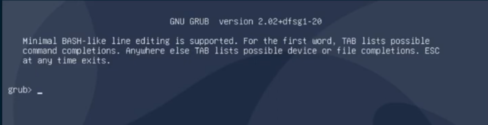
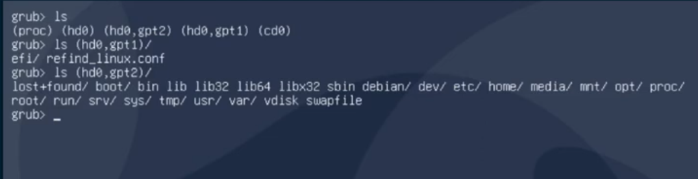

<h3>RECUPERAR O GRUB</h3>

 * Descobrir partições
 * Carregar o kenel 
 * Carregar initrd
 * Boot
 

* Tela do grub - aqui pra saber mais sobre os comandos pode digitar **help** porém ficara confusa  a leitura, logo ppode passar um comando dizendo ao interpretador de comando que você quer um paginador, considerando que esse é um shel reesumido do grub. O comando é `set paper=1`.

1. Liste as partições que o grub conseguiu identificar
`ls`

2. liste a partição que encontra-se o kernel do SO
`ls (hd0,gpt1)`
   ~
    efi/refind_linux.conf
   ~

3. Liste a segunda partição para verificar onde esta o seu Sistema operacional com todos seus arquivos.
`ls (hd0,gpt2)`

4. Listar o kernel que fica na partição /boot, o que irá interessar serãpo os arquivos que possuem o termo **vmlinuz...**
`ls (hd0,gtp2)/boot`

5. Fazer o Linux carregar o Kernel, passando o diretório de montagem.
`linux (hd0,gpt2)/boot/vmlinuz-5.6.13-gnu` root=dev/vda2

>NOTA:Caso não saiba onde esta sua partição de montagem pode usar o comando `cat (hd0,gpt2)/etc/fstab` para descobir onde eta o sistema.

6. Após identificar a partição do SO, entre com o comando.
`linux (hd0,gpt2)/boot/vmlinuz-5.6.13-gnu` root=/dev/sda2

7. Carregue o initrd que é um disco inicial que por enquanto esta somente em um arquivo que o kenel quando esta ronando monta primeiro esse cara para dali pegar alguns módulos  e ser capaz de montar `\`.
`initrd (hd0,gpt2)/boot/initrdd.img-5.6.13-gnu`

8. aplica o comando `booot`.

!!PRONTO!!
 