<h3>PROBLEMAS QUE PODEM OCORRER DURANTE INSTALAÇÃO DEBAIN</h3>

**MANUAL DEBIAN**
* www.debian.org/releases/stable/amd64/index.pt.html

* BOOT
>Indicar o dispositivo que ira iniciar o sistema. ou UEFI ou BIOS., a partir do debian BUSTER não precisa desabilitar o "SECURITY BOOT". comanado **DD - Despejo de disco**,as imagens ja credenciam os dois tipos de sistema, UEFI / BIOS., pode ainda calcular o rash da imagem baixada para checar se a imgaem baixada esta ok.

* REDE
>Alguns noteboks precisam de firmware não livres, e como isso pode se deparar com tela reportando com a referẽncia dessa necessidade de firmware não livre, pode baixar de outro computador e apontar a mídia contendo o firmware não livre. Quando tem mais de uma placa o sistema ira detectar e pedir para escolher qual placa deseja usar, rede que não atribui automaticamente ip via DHCP, pode checar primeramente problema físico, cabo por exemplo. Porém saiba o endereço de seguimento do ip pode configurar manualmente, mais ainda pode continuar a instalação, falta da rede não impede a instalação do sistema.

* PARTICIONAMENTO
>Ler atentamente a msg para não apagar disco inteiro, pode separar com atencedẽncia uma partição para instalar ou fazer manualmente os particonamento. Uma observação os sistemas microsoft utilizam um sistema chamaqdo FAST BOOT ,que faz parecer que a iniciação do sistema é mais rápido, porém o que ele faz é uma hibernação., digo isso porque aqui pode ter problema ao participar o disco e durante a instalação do LINux ele reclamar que o modo hibernação do windows, isso em caso de DUAL boot,  esta ligado, e ai precisa desabilitar esse recurso no windows.

* GRUB
>Observer tipo de boot UEFI/GPT.

* INTERRUPÇÃO
>Interrução energia, pode ocorrer. com isso precisara realizar o boot e recomeçar o processo de instalação sem problemas.


<h3>MODELO MENTAL DO BOOT</h3>

* BIOS (BASIC INPUT OUTPUT SYSTEM)
>Sistema que funciona desde a década de 80 e computadores até uns 10 12 anos atrás ainda funcionava com esse mesmo esquema extremamente limitado sem praticamente nenhum recurso muito alimentar e o processo de boot então ele tinha que passar por uma quantidade bastante grande de etapas até que se conseguisse iteração com o sistema operacional.

* UEFI->GPT,DOS,FAT,PE,secure-boot
De uns anos para cá a maior parte das máquinas já possuem o que substitui o bios que é uefi ou efe tem diversas vantagens sobre a bios e eu vou citar algumas delas aqui em qual f conhece ela tem inteligência faz parte do software embutido.
conhecimento o entendimento de como funciona o sistema de particionamento gpt, também conhece o funcionamento do particionamento DOS, conhece o sistema de arquivos fat a bios não conhece qualquer sistema de ar que é ficou esse também o formato de arquivos. Tem recursos programas ali dentro para poder implementar o **secure boot** security é um recurso que faz com que a bios só carregue aquilo que foi assinado por certificados que estão gravados na máquina fazendo com que o sistema não boot qualquer coisa, é um mecanismo bastante interessante muita gente achou que isso era apenas para impedir que os gnu-linux funcionar sem o jogador mais no fim das contas isso acaba servindo de um recurso bastante interessante de configuração e de segurança para corporações, e para uso em desktops.


* Coreboot

* Libreboot

<h3>PARTICIONAMENTO</h3>

* dos/MBR -> 4 partições, 2TB
* GPT - Guid Partition table
* GUID - Globally Unique Identifiers
* 128 partições, 9ZB -> 1ZB 1 bilhão de Tb.

* MBR (512) bytes.
 * stage 1 
  * Primeiros 64 bytes (contém a tablea de partições DOS)
  * Pŕoximos 446 bytes (contém o bootloader) programa que da início ao carregamento do sistema operacional, os bootloaders mais moderno ainda usam um stagio após esse para somente depois começarem as partições.

 * stage 1,5
   

* GPT 
 * Possui Tabela GPT primária e secundária parao caso de algum problema ocorrer.

ESTRUTURA| 
|--------|
Protective MBR |
Primary GPT HEADER |
Entry1 Entry2 Entry 3 Entry4 |
Partition 1 |
Partition 2 |
Remaining Partitions |
Entry1 Entry2 Entry3 Entry4 |
Eentrries 5-18|
Secundary GPT Header |

* BOOTLOADER

GLUB | (Mais de um estágio)
|----|----------------
Estágios|
grub4.efi|
módulos| para poder carregar sistema de aruqivos, módulos de vídeo, criptografia, usar volumes lógicos 
/boot|

>Quando utilizamos a UEFI não precisa de vários estágios porque a UEFI é capaz de entender o sistema de arquivos, portando é capaz de pegar um glub todo, não sendo estágio por estágio e que constuma estar em um arquivo que no caso do **grub** se chama grub64.efi, e esse grub64 também contém os vários módulos necessários, como módulos de rede, sistema de arquivos etc.

* KERNEL
>O Kernel dentro da nossa estrutura de diretório, ele é um arquivo, apenas um arquivo **/vmlinuz/boot/vmlinuz-5.6.13-gnu5-> 15 MB**  esse **z** porquqe esse arquivo  [FHC](https://refspecs.linuxfoundation.org/fhs.shtml)
  * Wwol - Cadas programa de um jeito!
  * Unix like - "Cada coisa no lugar definido"fica compactado dentro da nossa estrutura de diretórios, localizaod dentro do /boot. Esse não tem tamanho fisico depedendo das complicações gerais, a menos que venha pdronizado da equipe do debian. mais nada impede de você compilar seu próprio kernel.

>Módulos | nem tudo que ta no código do kernel esta nesse arquivo do kernel, esta separado, em módulos, o que da um tamanho de 300 MB em média. O que acontece todos os dispositivos que o kernel tem suporte e que na compilação foram determinados para serem compilados, alguns são includos no próprio kernel que chamamos de **módulos BUITIN ou embutidos** e outros tantos foram separados. Então quando vocẽ instala um pacote de kernel, você vai instalar além do arquivo que é o kernel que é esse supramencionado acima, como também um conjunto enorme de módulos queq totalizam ai em torno de 300MB. E justamente por essa formulação modular voce leve o hd que instalou em uma maquina e levar para outra ele vai funcionar embora os hardwares sejam diferentes, lógico que desde que a arquitetura seja a mesma, porque o kernel em tempo de execução, quando ta rodando conversando com os barramentos descobre que hardware e módulo é necessário.


* /INITRD.IMG 
  * /boot/initrd.img-5.6.13-gnu

>É uma imagem de disco, ou melhor é uma imgem de disco, se olharmos dentro ele terá uma porção do  kernel, módulos que não estão no arquivo do kernel mais que são necessários para a sua maquina conseguir ter acesso ao dispositivo principal onde eta o sistema, ou seja seu HD, ele vai incluir esses módulos que são necessário para dar boot ao seu sistema. Quando você instala uma nova versão de kernel, um novo **INITRD.IMG** é montado com as coisas fundamentais que a sua máquina precisa ter acesso a raiz de iretorios e montar o \ , ou seja ter acesso a esturuta de diretório, possui um tamanho 8 a 20 MB porque também tem como a gente interferir como ele é criado. A exemplo posso criar um initrd.img em minha maquina, leva ro hd para outra e não funcionar, dar boot até que refaça o arquivo com os módulos necessários, o nome do arquivo também apresenta o nome da versão ao kernel, cada kernel tem um INITRD.IMG.


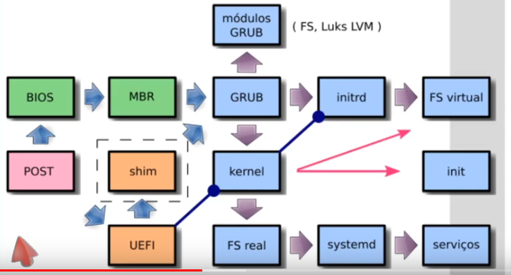
>Estrutura do BOOT - inicialização


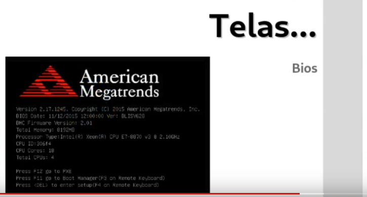
>BIOS - Identificando os dispositivos

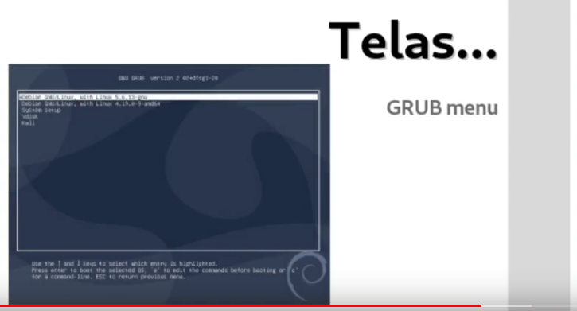
>Menu GLUB 

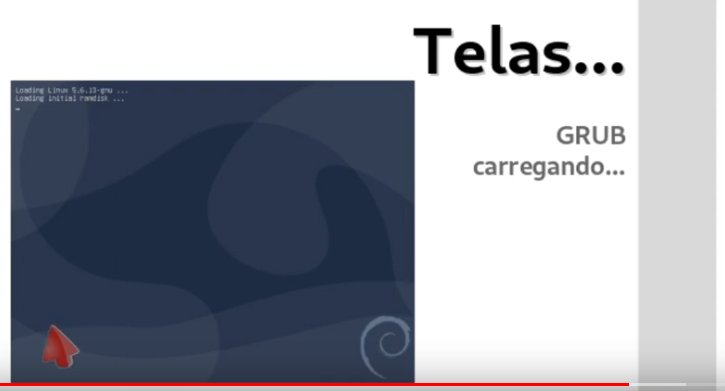
>Carregando o INITRD E KERNEL - papel do BOOTLOADER.

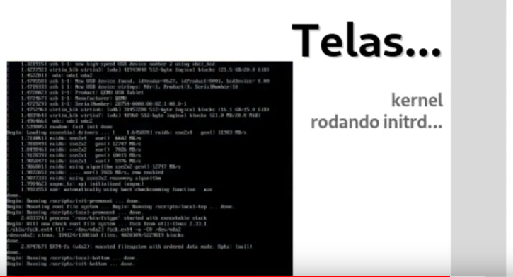
>SCRIPT INIT DENTRO DO INITRD.IMG - CARREGANDO TODOS OS SERVIÇOS NECESSÁRIO PAR FUNCIONAR.

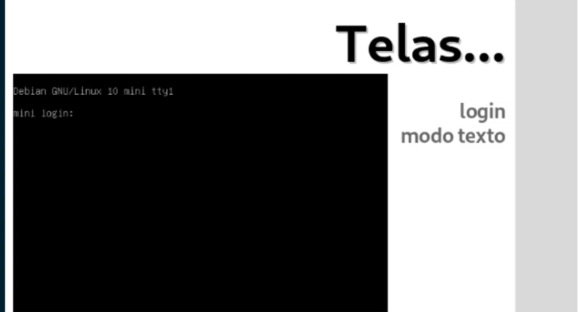
>LOGIN

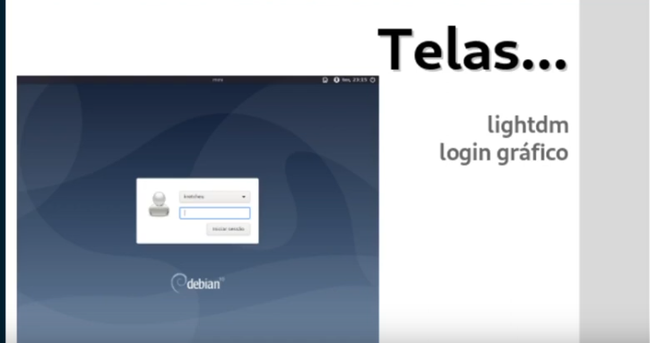
>Caso tenha instalado um ambiente gráfico será chamado uma tela que chamamos sde gestor de login gráfico.

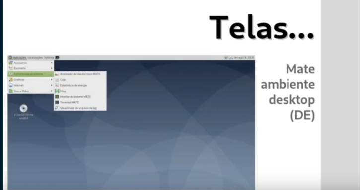
>Ambiente DESKTOP, exemplo MATE, DE - Desktop Enviroment.


* PRINCIPIOS DO UNIX
 * HISTÓRICO
 >1956 | KEN THOPSON E DENNIS RITCHIE que começaram nos laboratŕios BELL LABS, MIT, AT&ET, Desenvolvendo um sistema chamado **MULTICS** algo como múltiplus, mais essa junção dessas empresa não deu muuito certo devido terem finalidade divergentes, interesses específicos.

>1969 | Começaram a desenvolver um sitema chamado UNICs -> Unix origem do 'X' do GNULINUX em assembry.

>1973 Começaram a desenvolver um sistema operacional chamado UNIX em uma linguagem chamada 'C'.

>KEN THOMPSON é o criador da linguagem B que mesmo apesar do tempo um dos criadores da linguagem GO.

>IDEIAS | Uma coisa, bem feira, trabrarem juntos, texto interface universal.


>MODELOS | KISS **Keep It Simple Stupid** ou seja mantenha isso simples.

>MODULAR | FLuxo da informação "fluxo -> pipe -> cano, exemplo " **programa1 | programa2** simples combinado  -> complexo.

>ABSTRAÇÃO | Representação arquivo árvore, som, impressora, FHS - Filesystem Hierarchy Standard, que começa no /.

<h3>FHS</h3>
>Filesystem Hierarchy Standart

* Origem 
>Originado Em 1996 quando começaram os trabalhos para definição desse PADRÃO juntamente com a comunidade do BSD - Univserisdade da Califórnia. Hoje é mantido pela LINUX FUNDATION.
 * fonte:
 [FHC](https://refspecs.linuxfoundation.org/fhs.shtml)
  * Wwol - Cadas programa de um jeito!
  * Unix like - "Cada coisa no lugar definido"

  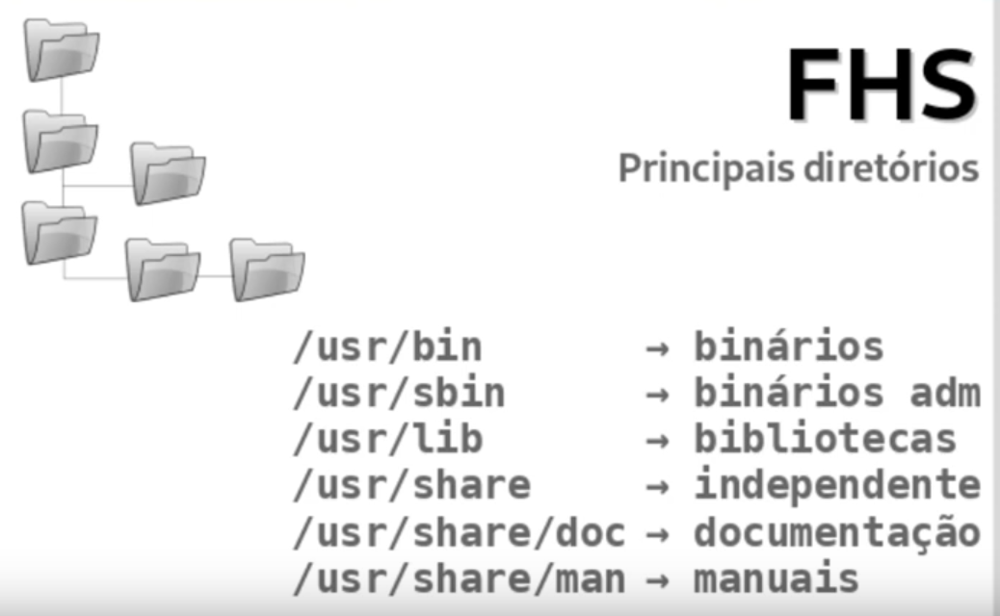

DIRETÓRIO | Descrição
|--------|-----------
/ | Diretório Raiz
/proc| Processos
/dev |Dispositivos
/boot | Kernel, initrd
/bin | binários (E) Binários essenciais para o sistema
/sbin | binários (adm) Essenciais para adm do sistema 
/lib | bibliotecas - Biblioteca de funçãos que são usadas pelos programas que estão no /bin e /sbin
/etc | Configuração - Aqui todos os programs colocam seus arquivos de configs, para programas maiores com mais arquivos de config. tem um subdiretorio dentro do /etc
/media | Removíveis | monta conteúdo pendrives HDs etc..
/mnt | Temporários - MOntagem termporários de volumos 
/root |Usuário ROOT - Diretório particular do usuário root 
/home | usuários  - Perfil dos usuários 
/var | Variável - Conteúdo variável, ex. servidores web suas páginas ficam em um subdiretório nessa pasta, assim como dentro desse diretíro esta o /var/log que serve para monitorar mensagem de programas.
/tmp | Arquivos temporários - conteúdo desse diretório é apagado quando desliga o sistema 
/usr/bin | Binários de instalação de programas que não são os oficiais encontram -se nesse diretório
/usr/sbin | Binários de administração do sistema 
/usr/lib | Biblioteca que os programas contidos no /usr/bin e usr/sbin estão aqui nesse diretório.
/usr/share | Aquivos independente da arquitetura x86 x64
/usr/share/doc | Documentação dos programas dentro desse diretório, cada programa tem seu subdiretório.
/usr/share/man | Manuais dos programas. 


<COMANDOS BÁSICOS - PROGRAMAS>

1.  cd (Alterar diretório)
2.  ls (Listar conteúdo de diretórios)
3.  mv (mover)
4.  mkdir (criar diretório)
5.  rmdir (remover diretório vazio)
6.  rm -rf (remover diretório não vazio)
7.  cat (imprime saída do conteúdo de arquivo de tela)
8.  less (paginador de tela e permite pesquisar temro usando o `/`)
9.  grep (filtrar termos)
10. find (localizar)
11. tail (ler ultimas linhas texto)
12. head (ler primeiras linhas de texto)
13. --help  (ajuda)
14. man (manual)
15. `|` (PIPE concatenar comandos)
16. `>` (direcionar saida)
17. `>>`  (acrescentar conteúdo ao final de um arquivo de texto)
18. cp (copiar arquivos/diretórios)

* [MATERIAL DE APOIO](https://www.inf.ufpr.br/cursos/ci055/artigos_linux_veteranos/gbbs14.pdf)
* [MATERIAL DE APOIO](https://cotidianoti.com.br/Comandos-basicos-linux/)


* Referẽncias
* Idéia Geral
* Princípais Diretórios
* Passeio

<h3>EDITORES DE TEXTO PURO</h3>

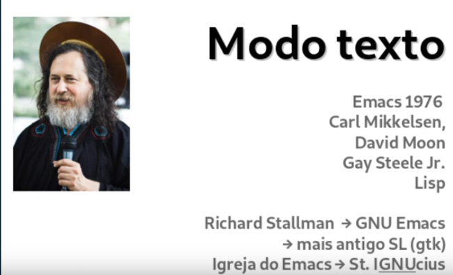

* Plain text
  ```Forma de representação de codificação simplificada inicialmente por caractere - como ASCII (padrão americano para troca de informações) este usa 7 bits de 1 byte que possuem um tamanho de 8 para representar os caracteres - São representados nesse padrão o alfabeto como também alguns caractesrs especiais como ASPAS, CIFRÃO, PORCENTAGEM etc.. os primeiros 32 caracteres de 0 a 31  são caracteres de controle, a exemplo o BEEP, atualmente existe a necessidade muito mais representação de caracteres, porque possuem vários outros idiomas que adotam cacaractres que não estão inclusos dentre esses 128 disponíveis no ASCII. Com isso ele foi evoluindo e hoje existem vários outros padrões, ATUALMENTE o mais utilizado é o UTF-8 (também chamadao de UNICODE) que quer dizer Unicode Transformation Code, este usa também como unidade um BYTE, porém pode usar de 1 até 4 bytes para representar cada 1 dos caracteres e com isso a quantidade de caracteres podendo ser representada pelo UTF-8 passa de um muilhão de caracteres, uma observação é que o ele é também compatível com o padrão ASCII uma vez que este possui a mesma representação no UTF-8, em resumo os caracteres representados pelo ASCII também é representado no UTF-8```.

  * IMPORTÂNCIA
   
    * Linguagem de programação
    * Unix-like
    * Arquivos de configuração 
    * Ambiente gráfico 
    * pluma
    * gedit
    * geany
    * kate
    * kwrite 

  * USO EM TERMINAIS
    * Nano, joe
    * vim vim-basic
    * nvi -> 4.4BSD
    * mcedit -> Midnight Commander.  

* Conteúdo adicional
    * (https://pt.wikipedia.org/wiki/ASCII)
    * (https://pt.wikipedia.org/wiki/UTF-8)
    * (https://pt.wikipedia.org/wiki/Texto_simples)

* Repositório para estudo de funcionalidades
    * (https://github.com/calangohc/apresentacoes/tree/master/vim-magnun)

* Videos (palestra VIM)
    * (https://www.youtube.com/watch?v=UUzW46SeLhg)
    

* SOBREVIVÊNCIA NO "VIM"
 * [Material de apoio](https://github.com/calangohc/apresentacoes/tree/master/vim-magnun) 

 * MODOS
   * COMANDO
   * VISUAL
   * INSERÇÃO
   * LINHA DE COMANDO

<h3>PACOTES</h3> 


* ASCII e derivados
* Unicode -> utf-8 compatível 

<h3>SISTEMAS DE ARQUIVOS</h3>
<h4>Conceitos</h4>

* Código Fonte
* Compilador
* Biblioteca de desenvolvimento
* Conhecimento Técnico Específico

>PACOTE:
* Um pacote de software é a menor unidade que pode ser instalado que usa pacotes, um poacote pode contar um único programa. Algumas vezes funciona por si só, apenas pensas daquele programa. Em outras circunstãncias precisa de bibliotecas de funções que são usadas por vários programas, Logo um pacote pode ser compostos por várias dessas bibliotecas. Há pacores ainda de documentação, como dentre outros como :
  * Fontes
  * Icones 
  * Temas de ambiente
  * Dados
  * Textos

>Um pacote pode ter mais de um programa, e um programa para funcionar pode precisar de vários pacotes. Porém existem pacotes que podem precisar de dependências, o que são essas **DEPENDÊNCIAS** são outros pacotes que aquele pacote que eu quero instalar precisa para que ele funcione, ou seja um apcote precisa de outro pacote, para que seja instalao o pacote A precisa do pacote B que essa por é necessário para o funcionando do pacote B. Pacotes debian vem recomendando existalação de pacotes dependentes. 


>O **PACOTE .DEB** nada mais é do que um arquivo compactadom em um formato chamado AR, esse arquivo compactado tem tudo que é preciso para isntalar aquele específico  pacote, como informações do que ele depende, as info daquele pacote vai fazer, quem fez, endereço do desenvolvedor, a imagem acima mostra a estrutura de uma pacote.

* \user
 * \bin (mostra os binários, ou seja esse pacote instala dois programas)

* \share (informação compartilhada do pacote)
 * \doc (Onde será alocada toda a documentação de todos os pacotes que são instalados)
 
* \man
 * \man1 (Manuais do programa - todo programa precisa ter uma página de manual seguindo assim a estrutura de empacotamento das disribuições)

* Pacotes também trazem scripts que são pequenos progarmas interpletados que poderão serem executados em alguns momentos no processo de instalação., antes da instalação, após remoção.

* A instalação de um pacote DEIAN não somente é a instalação de um pacote  e esse pacote realizar o que quizer em seu ambiente, esse pacote é interpletado, é aberto, é observado pelo gestor de pacotes e todas essas ações são praticadas, e existem registros dessas ações, logo é possivel saber quando um pacote foi instalado, se um pacote esta isntalado, usa-se no debian um sistema que consegue gerir, tomar contas dos pacotes para que possamos ter controle do nosso sistema de maneira completa. Um dos arquivos que vem no pacote é o **MD5SUMS** esse aruivo traz o hash da integridade dos arquivos. Cada arquivo que foi incluido por esse pacote é possível verificar mantém a integridade aos que foram produzidos. Podendo a qualquer tempo checar quanto a integridade dos mesmos.


<h3> BASE APT</h3>

* INSTALAR 
* REMOVER 
  * Remove tudo que o pacote instalou, mais mantém por uma questão de facilidade em alguns pacotes específicos, arquivos de configuração, caso instale um novo pacote ele não substituirá os arquivos ce configuração.

* ATUALIZAR LISTA 

  * Durante a instalação de um pacote , a ferramenta irá verificar existẽncia de dependência e caso precise irá instalar. Importante de tempos em tempos atualizar a base de pacotes disponíveis.

* ATUALIZAR SISTEMA 
  * compara a versão dos pacotes instalada com as versões diponíveis na lista para instalação, cabe isso ao gestor de pacotes realizar esse processo.

* PURGAR 
  * Remove o pacote instalado bem como suas ramificações, a exemplo: arquivos de configurações.

* ARQUIVO DEB

<h3>REPOSITÓRIOS</h3>

 * Onde estão localizados  o espelhos dos pacotes disponíveis na WEB., que funciona via HTTP, HTTPS, FTP.

 * /etc/apt/sources.list -  (espelhos de repositórios ficam espalhados pelo mundo inteiro)

 >Com essa estruruta de pacotes para quem não esta acostumado precisa verncer um paradígma de donwloade des progranas exe do universo windows, não há uma gestão de pacotes. Nos pacotes Linux tem seus próprios arquivos, não pode um arquivo estar em dois pacotes ao mesmo tempo, a forma de encontrar um programa é diferente, ou seja é priorizado a fonte oficial do sistema operacional.

<h3> GERENCIADORES DE PACOTE </h3>

 * DPKG 
 * APT  - 
 * APT-GET 
 * APTITUDE

 * SYNAPTIC
 * GNOME-SOFTWARE
 * DISCOVER
 * "LOJINHA" 

 <h3> BÁSICO </h3>
  
  COMANDO | Descrição
|--------|-----------
apt update | Consulta a lista de repostiórios que vocẽ configurou, acessa os sites e baixa a lista atualizada de todos os pacotes que estão lá disponíveis, bem como todas as informações de cada um desses pacote. 
apt search pesquisa | Pesquisa pacote com base em um parâmetro que deseja pesquisar, nome do pacote, bem como a funcionalidade do pacote, ex. `apt search pdf` irá pesquisar pacotes que manipulam arquivos PDFs.
apt install nome-pacote | Instalar um pacote
apt-remove | Desinstalar o pacote, se for um arquivo que possui arquivos de configuração separado, esses serão preservados. Para remover o pacote bem como seus arquivos de configurações, usamos o apt-purge e o nome do pacote `apt purge pacote`.
apt-upgrade | Serve para atualizar seu sistema, ele vai comparar na base do apt tudo que vocẽ tem instalado com toda  a lista de pacotes que esta disponíveis nos repostiórios, para saber se na lista de repositórios um pacote que vocẽ tem instalado e que possua uma versão mais recente.
apt full-upgrade | Atualização completa, porém caso tenha um pacote instalado que ja não faça mais parte na nova versão, esse será removido, em algumas circunstâncias será necessário remover alguns pacotes que vocẽ tem instalado.
dpkg -l | Lista todos os pacotes cum sua devida versão que temos instalado em nossa maquina.
dpkg -L | Saber arquivos que um pacote instalou em nossa maquina esse comando te retorna.

>Obs: cuidados ao remover pacote, observe as dependẽncias, na lista de pacotes  pode mostrar uma sigra `RC` que indica que o pacote foi removido porém seus arquivos de configuração permanecem.

<h3>SISTEMAS DE ARQUIVOS</h3>

* ABSTRAÇÕES
* ANALOGIA
* CONCEITOS
* TIPOS
* CARACTERISTICAS.

>Imagine que você tenha um terreno, e precisa alocar um espaço nesse terreno para um estacionamento, de forma rotativo, na análoogia esse terreno se chama partição. Porém esse terreno precisa ser preparado para ser usado como estacionamento, como faixas, Organização de como os carros vão entrar e sair, Cabine, nessa cabine precisara ter uma pessoa para realizar o controle de entradas e saidas, bem como o registro. Toda essa analogia e a de criar um sistema de arquivos, ou seja, o procedimento conhecido como formatar, eu formato uma partição, preparo um terreno para ser um estacionamento.Nessa história toda os carreos serão armazenados usando um método, como será o procedimento de quando chegar o carro, quando alguém for resgatar o carro. Nesse método também ta envolvido na cabine uma planchetinha que armazena informações características daquele carro, não o próprio carro mais as informações relativas ao carro, Placa, Vaga que ele foi colocado, nome do motorista, a hora que se deu o estacionamento. Tudo isso devidamente registrado na planchetinha, na nossa análogia isso é chamado a **ÁREA DE CONTROLE** veja que os carros são alocados de forma que um não atrapalhe o outro, é possível que você remova um carro mesmo que ele tenha chegado antes. Da mesma forma que os veículos são alocados em um armazenamento, os dados são alocado no **SISTEMA DE ARQUIVOS** , agora imagine que você tem o outro terreno com a mesma metragem quadrada e você quer nele também montar um estacioanmento, porém agora é um outro tipo de estacionamento, nesse este será perto de um porto de passageiros, esse tipo agora de estacionamento a forma de fazer as coisas é diferente porque os passageios vão chegando com seus carros e vão estacionando, mais eles não precisam tira os veículos do local por um tempo de 15, 20 ou 1 HR., vão todo mundo para o navio, realizam seu cruzeiro e na volta que removerão seus veículos. Observe que nesse estacionamento como no outro também foram pintadas faixas, cabine e se pensou na organização, como como esses veículos serã retiradas. Também nessa cabine desse estacionamento teremos uma planchetinha que descreve o metodo como esses carros vão ser armazendos contendo algumas informações específicas desse jeito guardar o carro. Além dessa plancheta também precisamos de uma pessoa que dentro da nossa analogia é um módulo do **KERNEL** o Kernel precisa conhecer, e ele conhece isso através de um módulo como é que as infomrações são armazenadas. O estacionamento funcionou, os carreos foram guardados e podem também serem recuperados, mais veja na ultima imagem tem um carro atrás de outro., notem que ambos os estacionamento são iguais, note que os estacionamento possuem o mesmo tamanho, a mesma dimensão. Mais em virutde da finalidade que cada estacionamento possui, a maneira de armazenar os carros é diferente o que provoca várias coisas, por exemplo, um estacionaemnto o processo de tirar um carro e colocar um carro é muito fácil, ja no segundo é muito mais dificil isso, caso precise tirar um carro que esteja em local onde outros carros estão obstruindo, será necessário remover outros carros para somente poder remover o carro específico que deseja. De maneira que é possível determinar que cada sistema pos,ui suas características adequada de alocação, pode ser adequada a uma finalidade mais não a outra, cada sistema de arquivo é melhor em uma ou outra condição, não existe um sistema de arquivo melhor em todos os sentidos. um conceito importante e que temos uma estrutura ai que são camadas de abstração.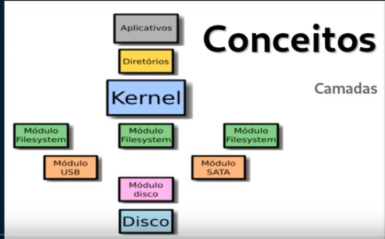 Os programas desconhecem essa história, isso é apenas na abstração que o KERNEL engrega para eles. E nós u suários entendemos que os arquivos estão em diretórios, mais nós ja sabemos que os arquivos são armazenados em uma partição usando um sitema de arquivos e o kernel tem acesso a isso porque ele possui um módulo que conhece o método, a forma com que as informações são armazenadas naquele disco, mais para o kernel te entragar essa abstração ele precisa de módulos de onde  o disco esta conectado, em que barramento, um módulo especifico, cada disco pode ter um módulo ou driver diferente para funcionar. É importante saber que um disco não tem diretório, não tem arquivo. O disco tem blocos de 1 e 0, então o disco não entende essa estrutura, a estrutura é uma abstração que esses módulos e o kernel promovem para ficar fácil para os aplicativos e para nós. 
Existse um conceito chamado **INODE** que é um espaço na planchetinha localizada na área de dados que contém infomrações chamadas  **METADADOS** sobre um arquivo ou sobre um diretório. Os **METADADOS** são informações relativas ao arquivo mais não o dado em si, são informações como:
* tempo
* permissões
* tipo 
* tamanho
* endereço  500 - (endereço de um bloco da área onde esses dados do arquivo efetivamente estão) nesse caso o endreço do bloco que contém os dados desse arquivo é o 500.

> Cada **INODE** possui um número único no sistema da arquivos.

>Quando **APAGAMOS** uma informação no disco, e limpado apenas a  informação de dados do bloco  que contém os dados do diretório/arquivo, ou seja do ponto de vista de nossa abstração esse dado foi removido, porém os dados em si permanecem, os dados não são nem tocados, os blocos do disco que são utilizados para armazenar esses dados não são nem mexidos, por isso é possível recuperar com aplicativos específicos e não mais acessando a pasta ou local onde estavão. Apenas não sera mostrados/visualizados mais com comandos de listagem, nem abrindo o local onde antes mostra as informações do arquivo. Com isso o **INODE** é liberado e novamente pode receber outras informações. 

>Quando **FORMATAMOS UMA PARTIÇÃO** com os dados não acontecem nada, apenas é limpa a ára de controle, portando as informações dos **INODES** serão todas sobrescritas, mais os dodos mesmo dos arquivos vão continuar lá. Poratndo quando formatamos um disco para passar para frente ou descartar, outra pessoa pode usar uma ferramenta de rcuperação para recuperar esses dados, uma ferramenta linux muito boa para esse tipo de operação é o **FOREMOST**.

>Quando **MOVEMOS** um arquivo na realidade estamos apagando a infomação do arquivo que ele faz parte e copiando essas informaçõe para dos dados de outro diretório que agora ele fará parte. o **INODE** do arquivo não vai ser troacado, de modo que não havera necessidade de transferir uma grande quantidade de dados.

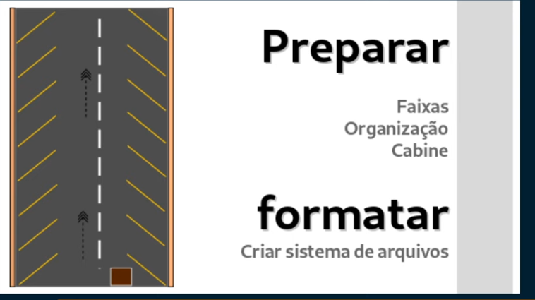

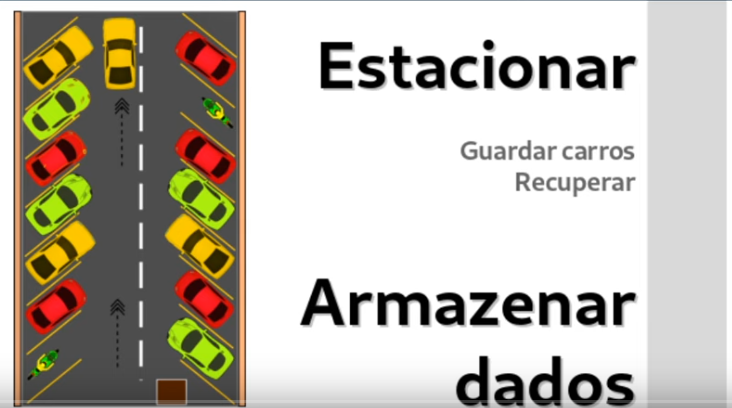

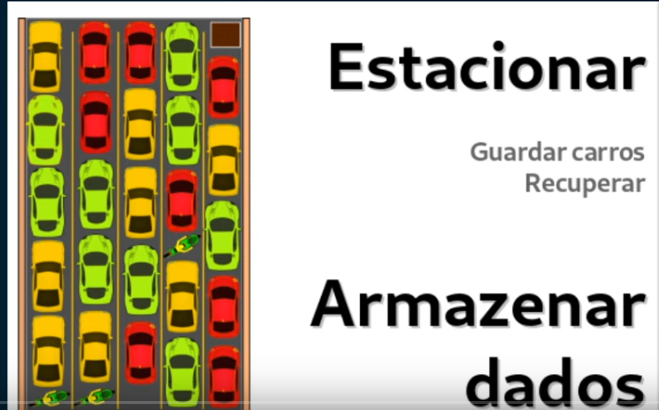


<h3>SISTEMA DE ARQUIVOS</h3>

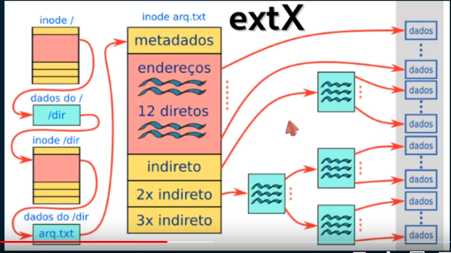

<h3>JOURNALING</h3>

>